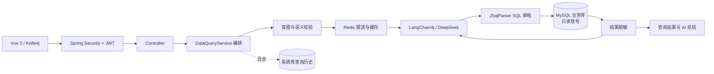

# AI 企业数据分析助手

面向企业业务库的自然语言数据查询系统。后端基于 Spring Boot 3、MySQL、Redis、Spring Security、LangChain4j 与大语言模型构建，重点实现 Text-to-SQL 的安全审核、只读执行、结果脱敏、缓存、限流与审计历史。

## 项目亮点

- **不是聊天机器人**：围绕企业业务库完成自然语言查询、SQL 审核、只读执行、结果分析和审计闭环。
- **纵深 SQL 防御**：Prompt 约束、意图校验、JSqlParser AST 审核、强制 `LIMIT`、查询超时和 MySQL 只读账号共同兜底。
- **双数据源隔离**：系统库由 MyBatis Plus 管理，动态业务 SQL 只能通过只读 `JdbcTemplate` 执行。
- **AI 自纠错**：多语句/格式错误最多修复一次，执行语法/字段错误使用剩余额度；共享最多两次，权限、网络和危险能力拒绝不重试。
- **数据最小暴露**：查询结果先脱敏，再发送给大模型总结；缓存和历史记录同样只保存脱敏数据。
- **性能与可观测性**：Redis 缓存、Lua 原子限流、独立审计线程池，以及 Micrometer 查询、缓存和线程池指标。

## 核心架构



完整设计见 [架构说明](docs/architecture.md)。

## 核心查询流程

1. Spring Security 验证 JWT 并取得当前用户。
2. 校验自然语言是否包含写操作意图、非法 TopN 等危险语义。
3. Redis Lua 脚本按用户执行每分钟查询限流。
4. 查询用户级语义缓存，命中时直接返回脱敏结果。
5. LangChain4j 调用大模型生成 SQL。
6. JSqlParser 检查单条 `SELECT`、表白名单、危险函数和最大 `LIMIT 1000`。
7. 使用 MySQL `SELECT` 权限账号执行动态 SQL，并设置查询超时。
8. 对结果中的手机号、邮箱、身份证号和银行卡号等信息脱敏。
9. 大模型同步生成业务总结，Redis 缓存完整安全响应。
10. 独立 JUC 线程池异步保存查询审计历史。

## 技术栈

| 层次 | 技术 |
|---|---|
| 后端 | Java 17、Spring Boot 3.2、Spring MVC、MyBatis Plus、JdbcTemplate |
| 安全 | Spring Security、JWT、BCrypt、JSqlParser |
| 数据 | MySQL 8、Redis、HikariCP |
| AI | LangChain4j、DeepSeek 兼容 OpenAI API |
| 并发与监控 | JUC 线程池、CompletableFuture、Micrometer、Actuator |
| 前端 | Vue 3、Vite、Element Plus、Axios |
| 工程化 | Maven Wrapper、Knife4j、Docker Compose |

## 工程结构

```text
src/main/java/com/aianalyst
├─ controller    HTTP 参数接收与统一响应
├─ service       业务能力接口及流程编排
├─ mapper        系统库 MyBatis Plus 数据访问
├─ dto / vo      请求与响应模型
├─ security      JWT 解析、认证过滤器与用户身份
├─ config        双数据源、线程池、OpenAPI 等配置
├─ filter        请求 Trace ID
└─ handler       全局异常处理

src/main/resources
├─ application.yml
├─ application-local.yml.example
└─ business-metadata.yml

frontend         Vue 3 前端
sql              数据库初始化脚本
docs             架构、接口与测试文档
```

## 本地开发

项目要求 JDK 17，并使用仓库中的 Maven Wrapper：

```powershell
.\mvnw.cmd test
.\mvnw.cmd spring-boot:run
```

本地数据库配置放在 `src/main/resources/application-local.yml`。请先将 `application-local.yml.example` 复制为该文件并填入本机凭据；实际文件已被 Git 忽略，不能提交 JWT 密钥、数据库密码或 DeepSeek Key。

本地接口文档：`http://localhost:8080/api/doc.html`，使用步骤见 [Knife4j 接口指南](docs/api-guide.md)。

## Docker Compose 部署（Linux）

> 当前 Docker Compose 是第一期基础配置。实际 Linux 部署已延期，计划在后续加入 RabbitMQ 后统一补齐前端 Nginx 和完整容器编排。

本项目提供一套独立的容器化演示环境，包含后端应用、MySQL 8 和 Redis 7。它不会使用或修改你 Windows 本机的 MySQL，也不会占用 Linux 上已有的 Redis `6379` 端口：MySQL 和 Redis 仅在 Docker 内部网络中开放，宿主机只暴露后端 `8080` 端口。

### 1. 前置条件

Linux 服务器需要已启动 Docker Engine，并具备 Docker Compose 插件：

```bash
docker info
docker compose version
```

### 2. 准备环境变量

在项目根目录执行：

```bash
cp .env.example .env
chmod 600 .env
```

编辑 `.env`，至少替换以下五项为真实私密值：

- `MYSQL_ROOT_PASSWORD`
- `MYSQL_SYSTEM_PASSWORD`
- `MYSQL_READONLY_PASSWORD`
- `JWT_SECRET`（至少 32 个字符）
- `DEEPSEEK_API_KEY`

`.env` 已被 Git 忽略。不要将其上传到 GitHub，也不要把真实密钥发到聊天记录中。

### 3. 构建并启动

```bash
docker compose up -d --build
docker compose ps
docker compose logs -f app
```

首次启动会拉取镜像、下载 Maven 依赖，并在 MySQL 数据卷为空时依次执行：

1. 创建 `ai_analyst`、`ai_business` 数据库及最小权限账号；
2. 创建系统表和业务表；
3. 导入演示业务数据。

应用、MySQL、Redis 均通过健康检查后，Linux 中可验证：

```bash
curl http://localhost:8080/api/actuator/health
```

从 Windows 访问 Linux 虚拟机时，将 `localhost` 换为虚拟机 IP，例如：

```text
http://192.168.6.7:8080/api/actuator/health
http://192.168.6.7:8080/api/doc.html
```

如果 Windows 无法访问 `8080`，再检查 Linux 防火墙是否放行该端口。

### 4. 常用运维命令

```bash
# 停止容器，但保留 MySQL / Redis 数据卷
docker compose down

# 查看所有容器状态
docker compose ps

# 持续查看后端日志
docker compose logs -f app
```

> `docker compose down -v` 会删除 Docker 中的 MySQL 和 Redis 数据卷，下一次启动会重新初始化演示数据。它不会删除 Windows 本机数据库，但属于清空容器数据的操作，执行前应确认。

## 核心接口

| Method | Path | 说明 |
|---|---|---|
| POST | `/api/auth/register` | 注册普通用户 |
| POST | `/api/auth/login` | 登录并获取 Bearer Token |
| GET | `/api/users/me` | 获取当前用户 |
| POST | `/api/queries/generate-sql` | 生成并审核 SQL |
| POST | `/api/queries/query` | 执行自然语言查询并返回 AI 总结 |
| GET | `/api/query-histories` | 分页查询当前用户的历史记录 |
| GET | `/api/actuator/health` | 服务健康检查，无需登录 |

`/api/actuator/metrics/**` 仅允许角色为 `ADMIN` 的用户访问。

## 数据库初始化（本地手动方式）

若不使用 Docker，使用 MySQL 管理员账号按顺序执行：

1. `sql/01_create_databases_and_users.sql`
2. `sql/02_system_schema.sql`
3. `sql/03_business_schema.sql`
4. `sql/04_business_seed_data.sql`

执行第一个脚本前，必须替换其中的示例密码。

## 前端开发

前端采用 Vue 3 + Vite + Element Plus，已经接入登录、注册、JWT 会话、智能查询、动态结果表格和当前用户查询历史。Token 过期时会提示重新登录，并在登录成功后返回原页面。

先保证后端已启动在 `http://127.0.0.1:8080/api`，再在另一个终端运行：

```powershell
cd frontend
npm.cmd install
npm.cmd run dev
```

访问 `http://127.0.0.1:5173`。开发服务器会把 `/api` 请求代理给 Spring Boot，因此本地开发不需要额外配置后端 CORS。

前端只在浏览器本地保存 JWT 与用户展示信息，**不会保存用户密码**。生产环境应将前端静态文件部署到 Nginx 或由后端统一托管，并改用 HTTPS。

联调与验收记录：

- 系统设计与面试讲解入口：[`docs/architecture.md`](docs/architecture.md)
- Knife4j 接口调用指南：[`docs/api-guide.md`](docs/api-guide.md)
- Day20 自动化联调结果与演示步骤：[`docs/day20-test-checklist.md`](docs/day20-test-checklist.md)
- Day21 浏览器联调与缺陷收口：[`docs/day21-test-report.md`](docs/day21-test-report.md)
- Day23 文档与 OpenAPI 验收：[`docs/day23-documentation-report.md`](docs/day23-documentation-report.md)
- Day24 核心 Service 单元测试与验收：[`docs/day24-test-report.md`](docs/day24-test-report.md)
- Day25 性能基线与 SQL 注入安全验证：[`docs/day25-performance-security-report.md`](docs/day25-performance-security-report.md)
- Day26 项目复盘与源码学习指南：[`docs/day26-project-review-study-guide.md`](docs/day26-project-review-study-guide.md)
- Day27 五个核心技术点与面试回答：[`docs/day27-core-technical-points-interview-guide.md`](docs/day27-core-technical-points-interview-guide.md)
- Day28 对话上下文分层存储：[`docs/day28-conversation-storage-guide.md`](docs/day28-conversation-storage-guide.md)
- Day29 最近窗口、追问改写与滚动摘要：[`docs/day29-context-window-guide.md`](docs/day29-context-window-guide.md)
- Day30 Token 预算、80%硬阈值与压力压缩：[`docs/day30-token-budget-guide.md`](docs/day30-token-budget-guide.md)
- Day28～30 多轮上下文综合学习手册：[`docs/day28-30-conversation-context-study-guide.md`](docs/day28-30-conversation-context-study-guide.md)
