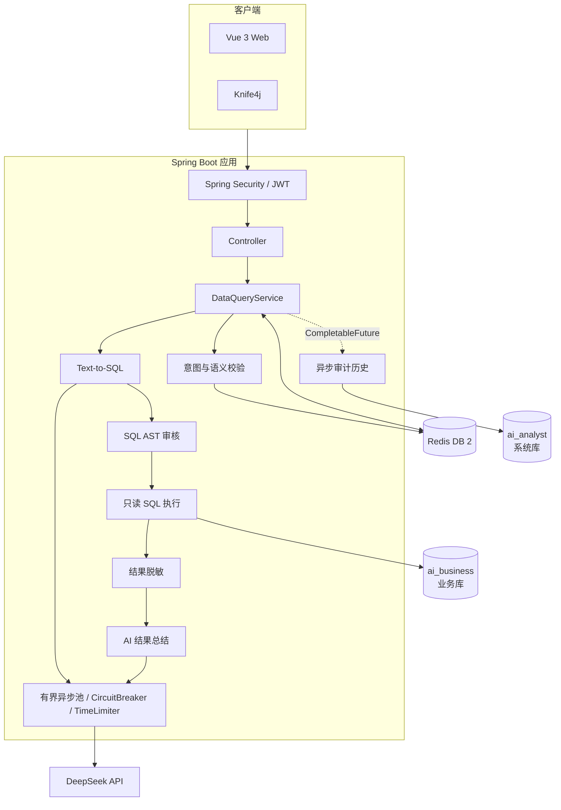
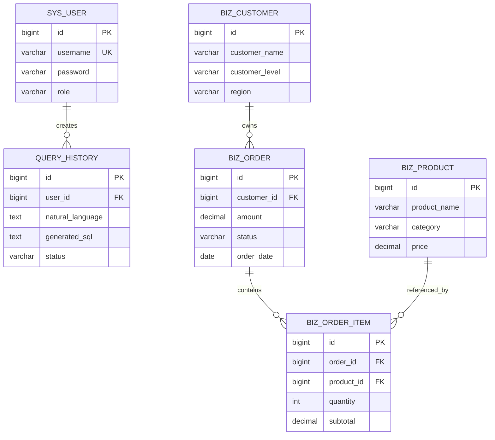

# AI 企业数据分析助手架构说明

## 1. 设计目标

系统面向企业内部数据分析场景：用户提交自然语言问题，服务端生成并审核 SQL，使用最小权限账号查询业务数据库，对结果脱敏后生成业务总结，同时保留可追溯的审计记录。

第一期采用模块化单体架构。一个月项目的重点是完成安全、可运行、可解释的业务闭环，不引入服务注册、分布式事务等当前规模不需要的复杂度。

## 2. 系统组件

## 3. 后端分层职责

| 层次 | 主要职责 | 约束 |
|---|---|---|
| Controller | 接收请求、参数校验、读取当前用户、返回统一结果 | 不编写业务流程和数据库逻辑 |
| Service | 单项业务能力与跨服务流程编排 | 核心逻辑可单元测试 |
| Mapper | 用户、查询历史等系统库访问 | 只操作固定表结构 |
| JdbcTemplate | 执行审核后的动态业务 SQL | 只注入具名只读数据源 |
| DTO / VO | 定义外部请求和安全响应 | Entity 不直接返回前端 |
| Security / Filter | JWT 认证、权限控制、Trace ID | 无状态，不创建 HTTP Session |
| Handler | 参数、业务、SQL 与系统异常的统一转换 | 不向客户端泄露数据库原始异常 |

`DataQueryServiceImpl` 是查询用例的编排层，不直接实现每项安全能力。意图校验、缓存、SQL 生成、执行、脱敏、总结和历史分别通过独立接口注入，方便替换与测试。

## 4. 双数据源与权限边界

| 数据源 | 数据库 | 账号权限 | 访问方式 | 保存内容 |
|---|---|---|---|---|
| systemDataSource | `ai_analyst` | 系统表正常读写 | MyBatis Plus | 用户、脱敏后的查询历史 |
| businessDataSource | `ai_business` | 仅 `SELECT` | 具名 `businessJdbcTemplate` | 客户、订单、商品、订单明细 |

动态 SQL 的返回列不固定，因此不建立 `BusinessDataMapper`。即使上层审核发生遗漏，MySQL `app_readonly` 账号也无法修改业务数据，这是数据库层最后一道防线。

## 5. SQL 安全防线

在调用模型前，独立校验器会直接拒绝索取系统 Prompt、覆盖系统指令、角色劫持、jailbreak 和要求生成危险 DDL/DML 等攻击，避免浪费模型费用。SQL 审核只接受单条 `SELECT`，拒绝多语句、未知表、`UNION`、文件读取或导出、休眠和基准测试等危险能力。正则只作为危险能力补充检查，语句类型和表引用以 AST 结果为准。

## 6. SQL 自纠错边界

系统使用一个共享的两次纠错预算。模型首次输出若仅因“多语句”或“SQL 无法解析”等输出格式问题被审核拒绝，可以消耗一次额度重新生成单条 `SELECT`；不得简单截取第一条语句，修复结果仍须重新经过完整审核。进入数据库执行后，系统先沿异常链检查 Spring 的 `PermissionDeniedDataAccessException`、SQLState `28xxx` 和 MySQL 权限错误码，再判断是否存在 `BadSqlGrammarException`。只有排除权限问题后的语法或字段类错误，才能使用剩余纠错额度。

以下情况直接终止，不调用模型重试：

- 未授权表、非 `SELECT`、危险函数、文件导出、`UNION` 等安全审核拒绝；
- 数据库连接失败或查询超时；
- 权限不足；
- 非语法类数据访问异常。

格式审核纠错最多一次，审核与执行纠错合计最多两次。这样可以防止无限重试、模型费用失控，以及使用“纠错流程”绕过安全审核。

## 7. Redis 设计

| 能力 | Key | 策略 |
|---|---|---|
| 用户查询限流 | `rate_limit:{userId}` | Lua 原子执行，固定窗口每分钟 5 次 |
| 查询结果缓存 | `query_cache:v1:{userId}:{questionHash}` | 用户隔离，问题归一化，TTL 30 分钟 |
| 会话状态 | `conversation:v1:{userId:conversationId}:meta` | Hash 保存摘要、状态、版本和 Token 估算 |
| 最近成功轮次 | `conversation:v1:{userId:conversationId}:turns` | List 保存最近 3 轮，Lua 版本 CAS 更新 |

缓存内容是已审核、已执行、已脱敏并包含 AI 总结的完整响应。Redis 不可用时，查询缓存会降级为正常查询流程；限流属于费用与流量保护，不静默放行。

## 8. 脱敏与大模型数据边界

业务库原始结果仅在当前请求方法内短暂存在。`DataMaskingService` 先处理手机号、邮箱、身份证号和银行卡号等信息，之后才允许数据进入以下位置：

- AI 结果总结 Prompt；
- HTTP 响应；
- Redis 查询缓存；
- `query_history` 审计记录。

为控制模型上下文和费用，结果总结最多采样 100 行、序列化内容最多约 12000 个字符。

### 8.1 Token 预算与压力压缩

所有模型调用都会本地估算完整 Prompt Token，并把最大输出和安全余量计入预算。默认模型窗口按 32768 Token 保守配置，超过 80% 前先压缩滚动摘要和即将离开窗口的早期轮次；压缩结果先通过 MySQL 乐观锁保存，再由 Redis Lua 原子裁剪。重新估算后仍超限则拒绝调用，不静默截断最近轮次。`conversation_session.estimated_tokens` 保存可复用上下文数据估算，真实调用仍以完整 Prompt 的即时估算为准。

## 9. 并发与审计历史

主查询链路同步返回 SQL、数据和 AI 总结，便于前端一次展示完整结果。阻塞式模型 I/O
通过 `@Async + CompletableFuture` 提交到有界线程池，并在业务线程上由 TimeLimiter
控制最长等待时间：

| 线程池 | 默认 core/max/queue | 承担任务 |
|---|---:|---|
| `llm-core` | 4 / 6 / 20 | 上下文规划、压缩、Text-to-SQL |
| `llm-analysis` | 1 / 2 / 10 | 可降级的结果总结 |
| `query-orchestration` | 4 / 8 / 50 | 后续异步查询编排预留 |

三个线程池均使用 `AbortPolicy`。队列耗尽时快速拒绝，不使用 `CallerRunsPolicy` 阻塞 HTTP
请求线程；线程池拒绝也不会计入模型供应商熔断失败率。上下文规划、Text-to-SQL、上下文
压缩和结果总结各自拥有独立 CircuitBreaker，避免可选分析故障拖累核心 SQL 生成。

历史记录不影响响应，因此通过 `CompletableFuture.runAsync` 写入另一套独立线程池：

- 核心线程数：2；
- 最大线程数：4；
- 有界队列：200；
- 拒绝策略：`AbortPolicy`，记录告警但不反向阻塞主请求；
- 应用关闭时最多等待 10 秒完成队列任务。

## 10. 数据模型

## 11. 可观测性

- `RequestIdFilter` 为请求生成或透传 Trace ID，并写入 MDC 日志。
- Actuator 暴露健康状态和 Micrometer 指标。
- 普通用户只能匿名查看不含内部细节的健康状态。
- `/actuator/metrics/**` 只允许 `ADMIN` 访问。
- 指标覆盖查询总量、成功/失败、缓存命中、请求耗时、历史线程池状态，以及模型 Prompt Token 估算、上下文压缩和预算拒绝次数。
- Resilience4j 指标按阶段暴露调用结果、熔断状态、失败率、慢调用率和 TimeLimiter 超时。
- `ai.model.executor.*` 使用固定 `pool` 标签暴露三类模型工作线程池的活跃数、队列占用和剩余容量。
- `/actuator/circuitbreakers`、`/actuator/circuitbreakerevents`、`/actuator/timelimiters` 和
  `/actuator/timelimiterevents` 仅对管理员开放。

## 12. 后续扩展边界

- 字段级白名单：第二期基于 JSqlParser AST 校验所有物理列引用，解析表别名和查询结果别名，禁止普通 `SELECT *`/`table.*`，但允许不读取具体列值的 `COUNT(*)`；字段集合继续由业务元数据 YAML 统一提供。
- RabbitMQ：适合承担耗时分析任务、审计事件或通知，但第一期同步查询链路不依赖消息队列。
- Nginx 与 Docker Compose：计划在 RabbitMQ 接入后统一完成完整容器部署。
- 多租户：可在用户、元数据、缓存 Key 和业务数据源上增加 tenantId 隔离。
- 向量语义缓存：只有在问题规模和模型费用证明有必要时再引入 Embedding 与相似度检索。
