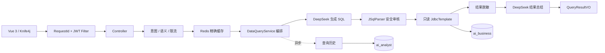
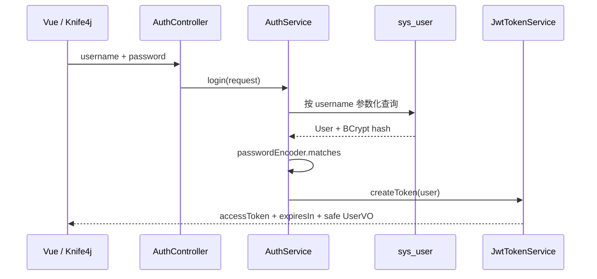
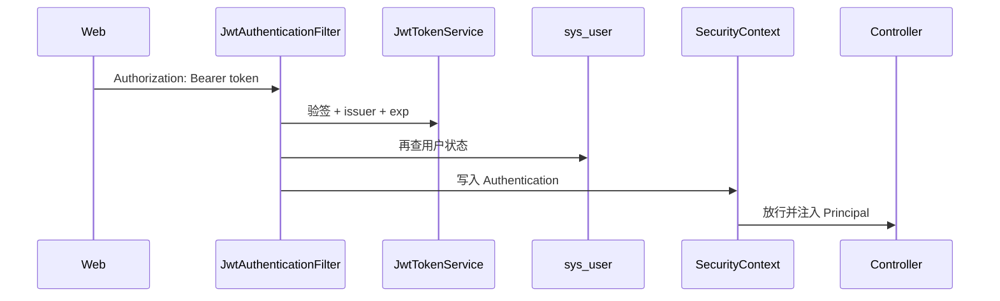

# Day26 项目复盘与源码学习指南

## 0. 这份文档怎么学

这不是一份需要背诵的项目介绍，而是一条源码阅读路线。建议你打开 IDEA，将本文和项目代码左右分屏：

1. 先看每节的“要解决的问题”；
2. 按链接打开对应源码；
3. 自己顺着构造器注入和方法调用向下追踪；
4. 不看参考答案，先回答每节的检查问题；
5. 最后用 Knife4j 或前端发一次真实请求，对照日志重新走完整链路。

Day26 的目标是让你理解“代码为什么这样组织”。Day27 再把这些理解整理成面试表达。

---

## 1. 先用一句话说明项目

AI 企业数据分析助手接收用户的自然语言问题，通过大模型生成 SQL，经过多层安全审核后使用只读账号查询企业业务库，再对结果脱敏、生成业务总结，并保存可追溯的查询历史。

它不是普通聊天机器人，因为系统的核心产出是：

- 一条经过审核、可以解释的 SQL；
- 一份来自真实业务数据库的查询结果；
- 一段基于脱敏数据的 AI 总结；
- 一条可以追溯成功、失败或安全拒绝原因的审计记录。

第一期选择模块化单体，而不是微服务。当前规模只有一个明确业务闭环，拆微服务会引入注册中心、远程调用、分布式事务和部署复杂度，却不会直接提升项目价值。

## 2. 先建立全局地图



最先要记住的不是类名，而是三条边界：

1. **身份边界**：用户身份只能来自通过 JWT 验证的服务端 Principal。
2. **数据源边界**：系统数据和企业业务数据使用不同数据源、不同账号和不同访问方式。
3. **敏感数据边界**：原始业务结果必须先脱敏，才能进入前端、Redis、AI 总结和查询历史。

## 3. 项目分层到底在解决什么

| 层次 | 本项目中的职责 | 不能做什么 |
|---|---|---|
| Controller | 接收 HTTP 参数、触发校验、取得当前用户、调用 Service | 不能拼 SQL、操作数据库或编排复杂业务 |
| Service 接口 | 定义一项可替换、可测试的业务能力 | 不依赖 HTTP 对象 |
| Service 实现 | 实现单项能力，或编排完整查询用例 | 不能把所有逻辑堆在一个“万能 Service”中 |
| Mapper | 访问结构固定的系统库表 | 不执行大模型生成的动态 SQL |
| JdbcTemplate | 执行已经审核的动态 SELECT | 不能使用系统库读写账号 |
| DTO | 表达外部请求并承载参数校验 | 不直接作为数据库实体 |
| VO | 表达允许返回给前端的数据 | 不能包含密码哈希等内部字段 |
| Entity | 映射系统库表 | 不直接作为 API 响应 |
| Filter / Security | Trace ID、JWT 解析、认证与授权 | 不编写查询业务逻辑 |
| Handler | 把异常转换为稳定、安全的统一响应 | 不向前端暴露数据库原始错误 |

先阅读：

- [QueryController](../src/main/java/com/aianalyst/controller/QueryController.java)
- [QueryRequest](../src/main/java/com/aianalyst/dto/QueryRequest.java)
- [QueryResultVO](../src/main/java/com/aianalyst/vo/QueryResultVO.java)
- [DataQueryService](../src/main/java/com/aianalyst/service/DataQueryService.java)
- [DataQueryServiceImpl](../src/main/java/com/aianalyst/service/impl/DataQueryServiceImpl.java)

检查问题：为什么 Controller 不直接调用 `TextToSqlService`、`SqlExecutionService` 和 `ResultAnalysisService`？

答案：Controller 应只负责协议适配。完整查询流程的先后顺序、失败分支和补偿策略属于业务用例，应集中在可单元测试的编排 Service 中。

---

## 4. 从一次真实请求理解完整调用链

假设用户提出：

```text
查询今年销售额最高的10个客户
```

### 4.1 HTTP 与身份阶段

1. Vue 的 Axios 请求拦截器把 Token 放入 `Authorization: Bearer ...`。
2. `RequestIdFilter` 生成或接收 `X-Request-Id`，写入 MDC。
3. `JwtAuthenticationFilter` 验签并解析 Token。
4. 过滤器再次查询当前用户，确保账号被禁用后旧 Token 不能继续使用。
5. 用户被写入 `SecurityContext`，Controller 通过 `@AuthenticationPrincipal` 得到 `SecurityUser`。
6. `@Valid` 校验问题不能为空，且最多 500 个字符。

对应源码：

- [前端 Axios 拦截器](../frontend/src/api/http.js)
- [RequestIdFilter](../src/main/java/com/aianalyst/filter/RequestIdFilter.java)
- [JwtAuthenticationFilter](../src/main/java/com/aianalyst/security/JwtAuthenticationFilter.java)
- [JwtTokenService](../src/main/java/com/aianalyst/security/JwtTokenService.java)
- [SecurityConfig](../src/main/java/com/aianalyst/config/SecurityConfig.java)

这里有两个容易说错的点：

- JWT 是服务器登录成功后签发的，不是用户自己创建的。
- JWT 验签成功不等于账号一定可用，所以项目又查询了一次数据库状态。

### 4.2 请求守卫阶段

`DefaultQueryRequestGuard` 的顺序是：

```text
写操作意图校验 → TopN 等语义校验 → Redis 限流
```

非法请求先拒绝，不应浪费 Redis 令牌和大模型费用。限流放在缓存之前，因为缓存命中虽然不调用模型，仍会消耗 Web、Redis 和审计资源，不能允许无限请求。

对应源码：

- [DefaultQueryRequestGuard](../src/main/java/com/aianalyst/service/impl/DefaultQueryRequestGuard.java)
- [RegexQueryIntentSafetyValidator](../src/main/java/com/aianalyst/service/impl/RegexQueryIntentSafetyValidator.java)
- [RegexQuerySemanticValidator](../src/main/java/com/aianalyst/service/impl/RegexQuerySemanticValidator.java)
- [RedisRateLimitServiceImpl](../src/main/java/com/aianalyst/service/impl/RedisRateLimitServiceImpl.java)

### 4.3 缓存阶段

系统对问题做 `trim`、合并空格和小写化，再计算 MD5，Key 中同时带上 `userId`：

```text
query_cache:v1:{userId}:{questionHash}
```

因此不同用户不会共享查询结果。命中缓存后直接返回已脱敏的完整结果，并异步保存一次新的查询历史。

必须准确理解：当前实现是**归一化后的精确缓存**，不是基于 Embedding 的真正语义相似缓存。“查询前10名客户”和“找出最好的十个客户”不会因为意思相近而自动命中同一个 Key。

对应源码：[RedisQueryCacheServiceImpl](../src/main/java/com/aianalyst/service/impl/RedisQueryCacheServiceImpl.java)

### 4.4 Text-to-SQL 阶段

1. `BusinessMetadataServiceImpl` 把 YAML 中的表、字段、关联关系和业务术语转为 Prompt 上下文。
2. `TextToSqlPromptBuilder` 加入固定规则，并把用户问题包在 `<question>` 边界中。
3. `DeepSeekChatServiceImpl` 通过 LangChain4j 调用兼容 OpenAI 协议的大模型 API。
4. `TextToSqlServiceImpl` 清理可能存在的 Markdown 代码块。
5. 模型输出按不可信输入处理，必须进入 SQL 审核。

对应源码：

- [business-metadata.yml](../src/main/resources/business-metadata.yml)
- [BusinessMetadataServiceImpl](../src/main/java/com/aianalyst/service/impl/BusinessMetadataServiceImpl.java)
- [TextToSqlPromptBuilder](../src/main/java/com/aianalyst/service/TextToSqlPromptBuilder.java)
- [DeepSeekChatServiceImpl](../src/main/java/com/aianalyst/service/impl/DeepSeekChatServiceImpl.java)
- [TextToSqlServiceImpl](../src/main/java/com/aianalyst/service/impl/TextToSqlServiceImpl.java)

为什么业务元数据不能只写数据库 DDL？因为“销售额”“有效订单”“今年”等业务概念不一定能从列名推断出来，必须显式告诉模型业务含义。

### 4.5 SQL 安全审核阶段

`SqlAuditServiceImpl` 完成以下工作：

1. SQL 不能为空；
2. 危险函数和文件导出能力被拒绝；
3. JSqlParser 只能解析出一条语句；
4. 语句必须是 `SELECT`；
5. 第一版拒绝 `UNION` 等组合查询；
6. 所有引用表必须在 YAML 白名单中；
7. 没有 LIMIT 时补 `LIMIT 1000`；
8. LIMIT 超过 1000 时压缩为 1000；
9. 非整数或负数 LIMIT 被拒绝。

对应源码：[SqlAuditServiceImpl](../src/main/java/com/aianalyst/service/impl/SqlAuditServiceImpl.java)

正则不是 SQL 审核的主防线。正则适合补充识别 `LOAD_FILE`、`SLEEP` 等危险能力；语句类型、表名、JOIN 和嵌套结构必须依靠 AST。

### 4.6 双数据源与执行阶段

系统库与业务库不是主从复制关系：

| 名称 | 实际用途 | 访问方式 |
|---|---|---|
| `ai_analyst` | 用户、角色、查询历史 | MyBatis Plus + 可读写账号 |
| `ai_business` | 客户、订单、商品、明细 | 独立 JdbcTemplate + 仅 SELECT 账号 |

所以本项目更准确的说法是**按职责和权限隔离的双数据源**，不要说成数据库主从读写分离。

动态 SQL 的返回列由用户问题决定，无法预先定义固定 Entity 和 Mapper，因此业务查询使用具名的 `businessJdbcTemplate`，返回 `List<Map<String, Object>>`。

对应源码：

- [DataSourceConfig](../src/main/java/com/aianalyst/config/DataSourceConfig.java)
- [SqlExecutionServiceImpl](../src/main/java/com/aianalyst/service/impl/SqlExecutionServiceImpl.java)
- [UserMapper](../src/main/java/com/aianalyst/mapper/UserMapper.java)
- [QueryHistoryMapper](../src/main/java/com/aianalyst/mapper/QueryHistoryMapper.java)

`Statement#setQueryTimeout(10)` 限制慢 SQL 占用连接。MySQL 只读账号是最后兜底：即使应用审核存在漏洞，账号也没有写权限。

### 4.7 SQL 自纠错阶段

执行失败后不能一律重试：

| 异常 | 是否请求模型修复 | 原因 |
|---|---|---|
| `BadSqlGrammarException` | 是，最多 2 次 | 字段名或语法可能由模型修正 |
| 连接失败 | 否 | 重新生成 SQL 不能恢复网络 |
| 查询超时 | 否 | 盲目重试可能继续占用资源 |
| 权限不足 | 否 | 不能通过模型绕过权限 |
| SQL 安全审核拒绝 | 否 | 安全拒绝不是语法问题 |

每次修复结果都重新经过完整 SQL 审核。数据库错误信息会截断，避免 Prompt 过大；原始错误不会直接返回前端。

主流程位置：[DataQueryServiceImpl](../src/main/java/com/aianalyst/service/impl/DataQueryServiceImpl.java)

### 4.8 脱敏与结果总结阶段

业务库原始行只在 `DataQueryServiceImpl` 当前方法中短暂存在。随后创建脱敏副本：

- 手机号：`13812345678 → 138****5678`
- 邮箱：`test@example.com → t***@example.com`
- 身份证和银行卡保留首尾部分字符

脱敏副本才允许进入：

- AI 结果总结；
- HTTP 响应；
- Redis 缓存；
- 查询历史。

总结最多采样 100 行、约 12000 个 JSON 字符。模型总结失败时返回降级文案，但已经查到的数据仍然正常返回。

对应源码：

- [RegexDataMaskingService](../src/main/java/com/aianalyst/service/impl/RegexDataMaskingService.java)
- [ResultAnalysisServiceImpl](../src/main/java/com/aianalyst/service/impl/ResultAnalysisServiceImpl.java)

### 4.9 异步历史阶段

用户必须同步拿到 SQL、数据和 AI 总结；查询历史只是旁路审计，因此异步写入。

线程池配置：

```text
corePoolSize = 2
maxPoolSize = 4
queueCapacity = 200
rejectionPolicy = AbortPolicy
shutdownWait = 10 秒
```

为什么不使用 `CallerRunsPolicy`？历史任务被拒绝时，如果让请求线程自己执行落库，就会把非核心任务的压力反向传递给用户请求。当前策略选择告警并丢弃极端情况下的单条历史，保护主链路。

对应源码：

- [QueryHistoryExecutorConfig](../src/main/java/com/aianalyst/config/QueryHistoryExecutorConfig.java)
- [QueryHistoryServiceImpl](../src/main/java/com/aianalyst/service/impl/QueryHistoryServiceImpl.java)

历史查询的 `userId` 来自 JWT Principal，而不是前端参数，这是防止用户查看他人历史的关键。

### 4.10 响应、异常、日志和指标阶段

- 所有成功与失败响应使用统一 `Result<T>` 结构。
- 参数异常返回具体字段错误。
- 业务异常返回稳定业务码。
- SQL 原始异常只写服务端日志，前端只看到通用提示。
- Request ID 同时出现在响应头和 MDC 日志中。
- Micrometer 只记录计数、耗时和线程池状态，不把问题、SQL 或结果作为标签。
- Actuator 健康检查允许匿名访问，详细 metrics 只允许 ADMIN。

对应源码：

- [Result](../src/main/java/com/aianalyst/common/Result.java)
- [ResultCode](../src/main/java/com/aianalyst/common/ResultCode.java)
- [GlobalExceptionHandler](../src/main/java/com/aianalyst/handler/GlobalExceptionHandler.java)
- [MicrometerQueryMetricsService](../src/main/java/com/aianalyst/service/impl/MicrometerQueryMetricsService.java)

---

## 5. JWT 登录链路专项复盘



后续请求：



需要掌握：

- BCrypt 是带盐的单向哈希，数据库不保存明文密码。
- JWT 是无状态身份凭证，服务端不创建 Session。
- Token 包含 `uid`、用户名和角色，但不包含密码。
- HMAC 密钥至少 32 字节，Token 同时校验签名、issuer 和过期时间。
- 普通用户访问 ADMIN metrics 时属于已认证但无权限，应返回 403；未登录属于 401。

当前前端把 JWT 保存在 `localStorage`。这适合本地演示，但生产环境必须重视 XSS 风险，至少需要 CSP、依赖安全和严格输出编码；也可以评估 HttpOnly Cookie，但那会重新引入 CSRF 等设计问题。

---

## 6. Redis 专项复盘

### 6.1 查询缓存

缓存是性能优化，不是正确性前提：

- 读缓存异常：记录 fallback 指标，继续走模型和数据库；
- 写缓存异常：记录日志，仍返回成功查询结果；
- TTL：30 分钟；
- Key 带用户 ID；
- Value 只能是已脱敏完整响应。

### 6.2 查询限流

Lua 脚本把 `GET`、判断、`SET/DECR` 和过期时间放在 Redis 内原子执行，避免 Java 多次网络调用之间发生并发竞争。

必须准确描述：当前实现是**每用户每分钟 5 次的固定窗口限流**，不是严格令牌桶。固定窗口简单，但窗口交界处可能出现突发流量；未来若业务需要更平滑的速率，可以升级为滑动窗口或令牌桶。

缓存失败允许降级，限流失败不允许静默放行。两者策略不同，是因为缓存只影响性能，而限流同时保护接口流量和模型费用。

---

## 7. 前端如何配合后端安全边界

建议按以下顺序阅读：

1. [router/index.js](../frontend/src/router/index.js)：路由守卫和页面结构；
2. [utils/auth.js](../frontend/src/utils/auth.js)：Token 与公开用户信息；
3. [api/http.js](../frontend/src/api/http.js)：Bearer Token、统一响应、401 过期跳转；
4. [QueryView.vue](../frontend/src/views/QueryView.vue)：自然语言提交和动态列展示；
5. [HistoryView.vue](../frontend/src/views/HistoryView.vue)：分页历史、详情和再次提问。

前端路由守卫只改善用户体验，不能作为真实权限控制。用户可以绕过前端直接发 HTTP 请求，因此真正权限必须由 Spring Security 和服务端 `userId` 隔离保证。

动态查询结果不能写死列名。前端从每一行 Map 中合并列集合，才能同时展示明细查询、聚合查询和排名查询。

历史页“再次提问”只回填问题而不自动执行，避免页面跳转意外消耗限流令牌和模型费用。

Day26 复盘发现并修复了一个状态契约问题：后端和数据库使用 `FAIL`，旧前端只识别 `FAILED`。当前页面已兼容 `FAIL/FAILED`，并把 `AUDIT_REJECT` 显示为“安全审核拒绝”。

---

## 8. 关键设计决策与取舍

| 决策 | 为什么这样做 | 当前代价 |
|---|---|---|
| 模块化单体 | 一个月内可交付，调用链清晰，事务和部署简单 | 规模扩大后需要重新划分模块边界 |
| AI 总结同步返回 | 前端一次获得完整演示结果 | 请求时延受模型影响 |
| 历史异步保存 | 不阻塞主查询响应 | 极端队列满时可能丢失单条历史 |
| YAML 业务元数据 | 修改业务术语不需要改 Java 代码 | 元数据需要人工维护并与数据库同步 |
| JSqlParser AST | 比正则更可靠地理解 SQL 结构 | 第一版主动限制 UNION 等复杂能力 |
| 只读 JdbcTemplate | 适配动态返回列，并绑定只读数据源 | 缺少固定 Mapper 的编译期字段检查 |
| Redis 精确缓存 | 实现简单、命中可解释、无额外模型费用 | 无法识别语义相近但文本不同的问题 |
| Redis 固定窗口 | Lua 实现简单且原子 | 窗口边界可能突发 |
| 正则值脱敏 | 适配动态字段，不依赖列名 | 可能存在误判或漏判，需要持续扩充规则 |
| JWT 无状态认证 | 适合前后端分离和水平扩容 | 主动注销和密钥轮换需要额外机制 |

工程设计没有“永远最好”，只有在当前目标、时间和风险下更合适的选择。

---

## 9. 故障场景应该怎样表现

| 故障场景 | 系统行为 | 是否影响已有查询结果 |
|---|---|---|
| Redis 查询缓存不可用 | 当作未命中，继续查询 | 否，只增加时延和模型费用 |
| Redis 限流不可用 | 请求失败，不静默放行 | 是，保护流量与费用 |
| Text-to-SQL 模型不可用 | 生成 SQL 失败 | 是，没有 SQL 无法继续 |
| SQL 语法错误 | 最多自纠错 2 次 | 可能恢复 |
| 数据库连接/权限错误 | 不做模型重试 | 是 |
| AI 结果总结不可用 | 返回降级总结 | 否，数据仍返回 |
| Redis 写缓存失败 | 记录日志，不缓存 | 否 |
| 历史落库失败 | 异步记录错误日志 | 否 |
| 历史线程池队列满 | 记录 rejected 指标和告警 | 否 |

这张表是理解“核心能力、增强能力、旁路能力”区别的关键。

---

## 10. 测试体系怎么对应生产风险

| 测试层次 | 代表文件 | 主要目标 |
|---|---|---|
| 单元测试 | [DataQueryServiceImplTest](../src/test/java/com/aianalyst/service/impl/DataQueryServiceImplTest.java) | 隔离依赖，验证完整流程分支和自纠错边界 |
| 安全测试 | [SqlInjectionDefenseTest](../src/test/java/com/aianalyst/security/SqlInjectionDefenseTest.java) | 验证传统 SQL 注入、Prompt 注入和危险 SQL |
| 认证测试 | [JwtTokenServiceTest](../src/test/java/com/aianalyst/security/JwtTokenServiceTest.java) | 验证签名、过期、issuer、密钥长度和篡改 |
| Redis 单元测试 | [RedisRateLimitServiceImplTest](../src/test/java/com/aianalyst/service/impl/RedisRateLimitServiceImplTest.java) | 验证 Lua 参数、Key 隔离和失败策略 |
| 按需集成测试 | `*IntegrationTest` | 连接真实 MySQL、Redis 或 DeepSeek |
| 性能冒烟 | [ApiPerformanceSmokeTest](../src/test/java/com/aianalyst/performance/ApiPerformanceSmokeTest.java) | 使用成功率和 P95 建立同机 HTTP 基线 |
| 浏览器联调 | [Day21 报告](day21-test-report.md) | 验证真实登录、查询、历史、过期跳转和退出 |

单元测试默认不能证明真实 Redis 或 MySQL 一定可连接；集成测试也不能代替对异常分支的快速、稳定单元测试。二者职责不同。

当前全量测试共 112 项，默认跳过需要外部环境或显式开启的测试。详细结果见 [Day24](day24-test-report.md) 和 [Day25](day25-performance-security-report.md)。

---

## 11. 推荐的源码阅读顺序

不要按文件夹字母顺序阅读，按调用链阅读：

### 第一轮：只看主干，不进入细节

1. `QueryController#query`
2. `DataQueryServiceImpl#query`
3. `TextToSqlServiceImpl#generateSql`
4. `SqlAuditServiceImpl#auditAndNormalize`
5. `SqlExecutionServiceImpl#executeAuditedSelect`
6. `RegexDataMaskingService#maskRows`
7. `ResultAnalysisServiceImpl#analyze`
8. `QueryHistoryServiceImpl#recordAsync`

目标：能画出一次查询的顺序。

### 第二轮：理解安全与基础设施

1. `SecurityConfig`
2. `JwtAuthenticationFilter`
3. `JwtTokenService`
4. `DataSourceConfig`
5. `RedisRateLimitServiceImpl`
6. `RedisQueryCacheServiceImpl`
7. `GlobalExceptionHandler`

目标：能解释每条安全边界在哪里落地。

### 第三轮：带着测试读异常分支

1. 打开某个 Service；
2. 同时打开同名 `*Test`；
3. 每看一个分支，就找到对应测试；
4. 尝试先写出预期，再运行测试确认。

目标：理解为什么可测试性会影响类的拆分方式。

---

## 12. Day26 自测题

先自己回答，再看下一节参考答案。

1. 为什么业务动态 SQL 不走 MyBatis Mapper？
2. 双数据源是不是 MySQL 主从读写分离？
3. 为什么模型输出 SELECT 后仍不能直接执行？
4. 为什么表白名单来自业务元数据，而不是在审核代码中再硬编码一份？
5. 为什么限流要放在缓存之前？
6. Redis 缓存失败和 Redis 限流失败为什么采用不同策略？
7. 当前缓存为什么不能称为真正的向量语义缓存？
8. 当前 Redis 限流为什么不是令牌桶？
9. 为什么只对 `BadSqlGrammarException` 做 AI 自纠错？
10. 为什么每次纠错后都必须重新审核 SQL？
11. 为什么脱敏必须发生在 AI 总结、缓存和历史记录之前？
12. 为什么历史线程池不用无界队列和 `CallerRunsPolicy`？
13. 为什么 JWT 验签后还要查一次用户状态？
14. 为什么前端路由守卫不能替代后端权限校验？
15. AI 总结失败后为什么仍返回成功查询数据？

## 13. 自测题参考答案

1. 返回列由用户问题动态决定，无法提前定义固定映射；审核后统一用只读 JdbcTemplate 更合适。
2. 不是。它是系统库与业务库按职责、账号权限和访问技术进行隔离。
3. 模型输出不可信，SELECT 仍可能包含未知表、文件读取、耗时函数、多语句或超大结果集。
4. 避免白名单和 Prompt 元数据出现两份来源，降低扩表时配置不一致风险。
5. 缓存命中仍消耗 Web、Redis 和审计资源，放在缓存后会让攻击者绕过流量保护。
6. 缓存只影响性能，可以降级；限流保护系统与模型费用，失败时放行会扩大风险。
7. 它只对归一化文本做精确 Hash，没有 Embedding 和相似度检索。
8. 它按 60 秒固定窗口维护剩余次数，没有持续补充令牌的速率和桶容量模型。
9. 语法或字段错误可能由模型修复；网络、超时和权限问题重新生成 SQL 没有意义。
10. 纠错模型同样可能生成危险 SQL，不能把修复通道变成安全绕过通道。
11. 否则原始敏感数据可能进入第三方模型、Redis、系统库或前端，扩大泄露面。
12. 无界队列可能耗尽内存；CallerRunsPolicy 会让请求线程执行历史落库，反向拖慢主链路。
13. 让管理员禁用账号后，已签发但未过期的 Token 也能立即失效。
14. 前端可以被绕过，真正的权限边界必须在服务端。
15. 查询结果是核心能力，总结是增强能力；第三方模型故障不应抹掉已经成功取得的数据。

---

## 14. 当前项目边界与后续方向

需要诚实说明当前没有完成的能力：

- 没有真正的向量语义缓存；
- 没有滑动窗口或令牌桶限流；
- 没有多租户数据隔离；
- 没有 JWT 主动注销黑名单和密钥轮换；
- 没有数据库主从复制；
- 没有完整生产级 Nginx、HTTPS 和容器部署验收；
- RabbitMQ 尚未接入；
- AI 总结仍同步影响主请求时延；
- Vue 页面目前采用静态导入，生产包仍有大 chunk 警告，后续可用路由懒加载拆包；
- 业务元数据需要人工与数据库结构保持一致。

后续 RabbitMQ 可以优先承担异步审计事件、耗时报告生成或通知，不建议为了使用中间件而强行拆散当前同步依赖链。Text-to-SQL、SQL 审核和执行之间存在严格前后依赖，第一期保持同步更清晰。

## 15. 今天的学习完成标准

完成 Day26 后，你不需要背出所有代码，但应该能够：

- 不看文档画出完整查询流程；
- 说明 Controller、编排 Service 和单项 Service 的区别；
- 准确说明双数据源不是主从读写分离；
- 准确说明当前缓存和限流的真实算法；
- 解释 SQL 安全的每一层为什么不能互相替代；
- 说明哪些故障会失败、哪些可以降级；
- 找到任意功能对应的 Controller、Service、数据访问和测试文件；
- 回答第 12 节至少 12 道题。

如果这些内容还不能顺畅回答，优先重新阅读 `DataQueryServiceImpl`，因为它是整个项目最重要的调用链地图。
