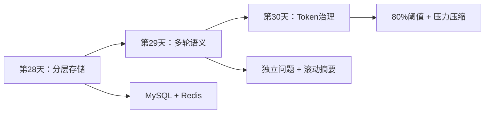
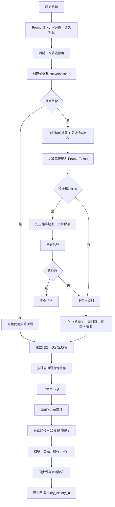

# 第28～30天学习手册：多轮上下文、滚动摘要与 Token 治理

## 1. 这三天解决了什么问题

在第27天之前，项目虽然能完成自然语言查询，但每次请求基本都是独立的：

```text
用户问题 → 生成 SQL → 审核 → 执行 → 返回结果
```

如果用户继续问：

```text
第1轮：查询今年销售额最高的10个客户
第2轮：那华中呢？
第3轮：换成去年
```

单轮系统无法知道“那华中呢”和“换成去年”分别继承什么条件。

第28～30天将项目升级为一个具备受控记忆能力的企业数据分析 Agent：

- 第28天：解决上下文保存在哪里、如何恢复、如何隔离用户；
- 第29天：解决如何理解追问、识别新话题、维护最近窗口和滚动摘要；
- 第30天：解决上下文太长时如何估算、压缩、拒绝和监控。

三天的关系是：



一句话概括：

> 第28天让系统“记得住”，第29天让系统“看得懂”，第30天让系统“记得久但不失控”。

---

## 2. 最终完整请求链路

完成三天建设后，完整查询链路变成：



这里最重要的设计思想是：

```text
模型负责理解和生成
确定性代码负责预算、安全、一致性和最终裁决
```

---

# 第一部分：第28天——对话上下文分层存储

## 3. 为什么要分层存储

只使用 MySQL：

- 数据可靠；
- 但每次追问都查询数据库，延迟更高；
- 高频会话会给系统库增加压力。

只使用 Redis：

- 读取速度快；
- 但 Key 过期、Redis 重启或缓存淘汰后会话丢失；
- 不适合作为长期权威数据源。

因此项目采用：

```text
MySQL：权威数据源、长期保存、可审计
Redis：活动会话热数据、快速读取、允许丢失后恢复
```

这是一种典型的分层存储设计。

## 4. MySQL 表如何分工

### 4.1 conversation_session

一条记录代表一个会话，主要保存状态：

| 字段 | 作用 |
|---|---|
| `conversation_id` | 对外暴露的 UUID |
| `user_id` | 会话所有者 |
| `rolling_summary` | 早期轮次滚动摘要 |
| `summary_until_turn` | 摘要已经覆盖到第几轮 |
| `structured_state` | 当前查询条件 JSON |
| `current_turn` | 当前最大轮次 |
| `estimated_tokens` | 当前可复用上下文估算 |
| `version` | 乐观锁版本 |
| `last_active_at` | 最后活跃时间 |

### 4.2 conversation_message

每一轮保存两条消息：

```text
USER      原始问题 + 独立问题
ASSISTANT 回答摘要 + queryHistoryId
```

不保存完整查询结果行，只保存脱敏后的回答摘要。

原因是会话记忆只需要“用户问了什么、系统得出了什么结论”，不应该复制大量业务明细。

### 4.3 query_history 与 conversation_message 的区别

```text
conversation_message：负责多轮语义
query_history：负责 SQL 安全与执行审计
```

例如：

| 问题 | 应查哪张表 |
|---|---|
| 用户第3轮说了什么 | `conversation_message` |
| 第3轮生成了什么 SQL | `query_history` |
| SQL 是否通过审核 | `query_history` |
| 第3轮的独立问题是什么 | `conversation_message` |

## 5. Redis 为什么使用 Hash + List

### 5.1 Hash 保存会话状态

```text
Key：conversation:v1:{userId:conversationId}:meta
类型：Hash
```

典型字段：

```text
userId
conversationId
rollingSummary
summaryUntilTurn
structuredState
estimatedTokens
currentTurn
version
lastActiveTime
```

Hash 适合保存字段明确、经常局部更新的会话元数据。

### 5.2 List 保存最近轮次

```text
Key：conversation:v1:{userId:conversationId}:turns
类型：List
```

List 中每个元素是一个精简后的成功轮次：

```json
{
  "turnId": 3,
  "originalQuestion": "那华中呢？",
  "standaloneQuestion": "查询今年华中地区销售额最高的10个客户",
  "answerSummary": "本次查询返回……",
  "status": "SUCCESS"
}
```

List 适合：

- 按时间顺序追加；
- 读取最近若干轮；
- 通过 `LTRIM` 删除最早轮次。

## 6. Redis Hash Tag 是什么

两个 Key 都包含：

```text
{userId:conversationId}
```

Redis Cluster 只对大括号中的部分计算槽位，因此：

```text
conversation:v1:{7:abc}:meta
conversation:v1:{7:abc}:turns
```

会落在同一个槽位，Lua 脚本才能同时原子操作两个 Key。

## 7. 为什么需要 Lua

会话追加或压缩通常需要同时完成：

```text
检查版本
更新 Hash
追加或裁剪 List
刷新两个 Key 的 TTL
```

如果拆成多次 Java 调用，并发请求可能在中间交错：

```text
请求A读取 version=7
请求B读取 version=7
请求B先写入 version=8
请求A后写入旧状态，覆盖请求B
```

Lua 在 Redis 内一次完成检查和更新，中间不会被其他命令插入。

## 8. 用户隔离为什么不能只靠 UUID

知道 `conversationId` 不代表拥有该会话。

每次访问都需要同时检查：

```text
conversationId + JWT中的userId
```

如果会话属于其他用户，返回无权限，而不是直接加载。

这可以避免用户猜测或窃取 UUID 后读取其他人的上下文。

## 9. 为什么会话轮次要同步保存

`query_history` 可以异步写入，因为它属于旁路审计；但会话轮次不能等异步任务完成后再保存。

错误流程：

```text
第1轮返回HTTP响应
    ↓
用户立即发送第2轮
    ↓
第1轮异步历史尚未完成
    ↓
第2轮读取不到第1轮
```

当前流程：

```text
同步保存 USER/ASSISTANT，会话立即可见
    ↓
返回HTTP响应
    ↓
query_history 异步完成后回填外键
```

这体现了一个原则：

> 影响下一次请求正确性的状态必须同步提交；不影响主结果的审计可以异步。

## 10. 第28天源码阅读顺序

1. `sql/05_conversation_context_schema.sql`
2. `entity/ConversationSession.java`
3. `entity/ConversationMessage.java`
4. `service/impl/ConversationPersistenceService.java`
5. `service/impl/RedisConversationContextStore.java`
6. `service/impl/ConversationContextServiceImpl.java`
7. `service/impl/DataQueryServiceImpl.java`

---

# 第二部分：第29天——追问改写与滚动摘要

## 11. 为什么不能把聊天记录直接拼给模型

直接拼接全部对话有四个问题：

1. Token 不断增长；
2. 模型费用和延迟不断增长；
3. 很久以前的条件可能干扰当前主题；
4. 历史中的攻击文本可能扩大 Prompt 注入面。

当前项目采用：

```text
滚动摘要 + 最近3个完整成功轮次 + 当前问题
```

## 12. 滚动摘要是不是滑动窗口

不是同一个东西，但二者配合使用。

```text
滑动窗口：决定哪些最近轮次保留完整内容
滚动摘要：承接离开窗口的早期信息
```

五轮示例：

| 阶段 | 摘要覆盖 | 最近完整轮次 |
|---|---:|---|
| 第1轮后 | 无 | 1 |
| 第2轮后 | 无 | 1、2 |
| 第3轮后 | 无 | 1、2、3 |
| 第4轮规划 | 1 | 2、3 |
| 第4轮成功 | 1 | 2、3、4 |
| 第5轮规划 | 1～2 | 3、4 |
| 第5轮成功 | 1～2 | 3、4、5 |

## 13. 为什么必须先摘要再删除

错误顺序：

```text
先 LTRIM 删除第1轮
再调用模型生成摘要
模型超时
第1轮信息永久丢失
```

正确顺序：

```text
生成摘要
    ↓
MySQL乐观锁保存摘要
    ↓
Redis Lua 更新摘要并裁剪旧轮次
```

## 14. 独立问题是什么

原始问题：

```text
换成去年
```

独立问题：

```text
查询去年华中地区销售额最高的10个客户
```

独立问题离开聊天记录后仍然能被理解。

它会用于：

- Text-to-SQL；
- SQL 纠错；
- 查询缓存 Key；
- `query_history.natural_language`；
- 会话状态提取。

前端响应仍回显用户原话，便于保持自然交互。

## 15. 为什么缓存 Key 使用独立问题

下面这句话在不同上下文中含义不同：

```text
那华中呢？
```

它可能表示：

```text
查询华中客户数
查询华中销售额
查询华中库存
```

如果按原话缓存，可能返回错误业务结果。独立问题包含完整指标、时间和过滤条件，更接近真正的查询语义。

## 16. 一次上下文规划完成什么

后续轮次使用一次规划调用同时生成：

```json
{
  "standaloneQuestion": "完整独立问题",
  "topicChanged": false,
  "structuredState": {
    "metric": "销售额",
    "dimensions": ["客户"],
    "filters": [{"field": "地区", "value": "华中"}],
    "timeRange": "去年",
    "orderBy": "销售额 DESC",
    "limit": 10
  },
  "rollingSummary": "早期轮次摘要"
}
```

首轮没有历史，直接使用原始问题，避免额外模型调用。

## 17. structuredState 有什么价值

自然语言摘要适合保存长期语义，但不适合稳定修改具体查询条件。

例如用户说：

```text
换成去年
```

结构化状态可以只修改：

```json
{"timeRange":"去年"}
```

并继续保留：

```text
metric=销售额
region=华中
limit=10
```

因此：

```text
滚动摘要：长期语义记忆
structuredState：当前查询参数
```

## 18. 如何识别新话题

如果用户问：

```text
查询客户总数
```

它已经是完整问题，而且与此前“去年华中销售额前10名”无关。

规划器返回：

```text
topicChanged=true
```

系统会：

- 清空旧滚动摘要；
- 清空旧最近轮次；
- 写入新结构化状态；
- 当前查询成功后成为新主题的第一轮。

## 19. 两次校验为什么只扣一次限流

```text
原始问题：安全校验 + 消耗1次限流额度
独立问题：再次安全校验 + 不重复扣额度
```

原因：

- 独立问题是模型输出，不能信任，必须再次检查；
- 但用户只发送了一次 HTTP 请求，不应该重复计费或限流。

## 20. 历史上下文也是非可信输入

即使历史内容来自自己的数据库，也不能当成系统指令。

规划 Prompt 明确声明历史只是数据，并且只传递：

```text
turnId
originalQuestion
standaloneQuestion
answerSummary
```

不会传递完整结果、数据库异常、系统 Prompt 或敏感字段。

## 21. 乐观锁解决什么问题

会话状态使用：

```sql
UPDATE conversation_session
SET version = version + 1, ...
WHERE conversation_id = ?
  AND user_id = ?
  AND version = ?;
```

只有版本匹配才能更新。

如果两个请求同时基于 version=7 生成摘要：

```text
请求A更新成功，version变为8
请求B更新0行，说明状态已经变化
请求B重新加载最新上下文再计算
```

Redis Lua 也检查期望版本。出现乱序写入时，不让旧版本覆盖新版本，而是淘汰 Redis 并从 MySQL 重建。

## 22. SQL 审核纠错和执行纠错

第29天验收时发现模型可能返回两条 SQL：

```text
SELECT ...;
SELECT ...;
```

JSqlParser 正确拒绝，但原有两次纠错只处理数据库执行失败，审核阶段不会触发。

当前使用共享两次纠错预算：

```text
多语句/无法解析：审核格式纠错最多1次
数据库语法/字段错误：使用剩余额度
两阶段合计最多2次
```

未授权表、危险函数、非 SELECT、权限、连接失败和超时不纠错。

不能直接取第一条 SQL，因为第二条可能包含危险操作。

## 23. 第29天源码阅读顺序

1. `dto/ConversationContextSnapshot.java`
2. `service/prompt/ConversationContextPromptBuilder.java`
3. `service/impl/DeepSeekConversationQuestionResolver.java`
4. `service/impl/DataQueryServiceImpl.java`
5. `mapper/ConversationSessionMapper.java`
6. `service/impl/RedisConversationContextStore.java`
7. `service/impl/TextToSqlServiceImpl.java`

---

# 第三部分：第30天——Token 预算与80%硬阈值

## 24. 为什么最近3轮还不够

轮次数量不能代表 Token 数量。

可能只有两轮，但每轮包含很长的问题和回答摘要；也可能有三轮很短的问题。

所以需要两套控制：

```text
最近3轮：日常窗口策略
80% Token：模型窗口安全阀
```

## 25. Token 为什么只能估算

精确 Token 数取决于具体模型的 tokenizer。

当前项目通过 OpenAI 兼容接口调用模型，但没有依赖供应商私有 tokenizer，因此使用本地保守估算：

```text
非ASCII字符：按2 Token
连续英文/数字：约4字符1 Token
标点和JSON结构：额外计算
每轮消息：增加固定结构开销
```

这个值用于安全预算，不是账单中的精确 Token。

面试时不要说：

> 我们已经精确计算了模型 Token。

应该说：

> 当前使用本地保守估算，并预留输出和安全余量；未来可以接入具体模型 tokenizer。

## 26. 80%如何计算

默认配置：

```text
模型窗口：32768
使用阈值：80%
输出预留：2048
安全余量：256
```

计算：

```text
硬阈值 = floor(32768 × 0.8) = 26214
最大Prompt = 26214 - 2048 - 256 = 23910
```

判断的是：

```text
Prompt估算 + 输出预留 + 安全余量 > 模型窗口80%
```

不是等 Prompt 自身达到80%才压缩。

## 27. 为什么要预留输出

模型窗口通常同时容纳输入和输出。

如果把全部窗口都交给输入：

```text
输入刚好塞满窗口
模型没有空间输出
请求失败或回答被截断
```

因此 `max-tokens` 必须提前从预算中扣除。

## 28. 压力压缩和普通滚动摘要的区别

普通滚动摘要：

```text
由最近轮次数量触发
例如第4轮到来时摘要第1轮
```

压力压缩：

```text
由完整 Prompt Token 超过80%触发
可能重新压缩已有摘要
可能提前处理即将离窗的最早轮次
```

压力压缩完成后必须重新估算，不能假设模型一定压缩成功。

## 29. 为什么压缩后仍可能拒绝

假设：

- 旧摘要已经很短；
- 最近轮次本身很长；
- 当前问题也很长。

如果继续删除最近轮次，模型可能失去重要条件；如果直接截断当前问题，可能改变用户意图。

因此系统选择：

```text
压缩后仍超限 → 返回 CONTEXT_WINDOW_EXCEEDED
```

提示用户缩短问题或新建会话。

这是“正确性优先于强行回答”。

## 30. 为什么需要全局模型调用保护

只在会话规划处判断还不够，因为项目还有：

- Text-to-SQL Prompt；
- SQL 纠错 Prompt；
- 结果总结 Prompt；
- 上下文压缩 Prompt。

`DeepSeekChatServiceImpl` 是统一出口，每次网络请求前都会重新检查预算。

```text
业务层：尽量压缩并恢复
统一出口：绝不允许越过硬阈值
```

## 31. estimated_tokens 到底保存什么

### session 层

`conversation_session.estimated_tokens` 保存：

```text
滚动摘要
+ structuredState
+ 最近成功轮次
+ 结构开销
```

### message 层

`conversation_message.estimated_tokens` 保存单条 USER 或 ASSISTANT 消息的估算。

### 为什么调用前还要重新算

数据库字段不包含：

- 规划器固定规则；
- Text-to-SQL 元数据；
- JSON 标签；
- 输出预留；
- 安全余量。

因此 `estimated_tokens` 适合状态观察，不能代替完整 Prompt 的实时预算。

## 32. Token 指标

| 指标 | 含义 |
|---|---|
| `ai.model.prompt.tokens.estimated` | 实际模型调用的 Prompt Token 估算 |
| `ai.model.token.budget.compression` | 压力压缩次数 |
| `ai.model.token.budget.rejected` | 超限拒绝次数 |

指标只记录数字，不记录用户问题、SQL 或结果。

## 33. 第30天源码阅读顺序

1. `config/DeepSeekProperties.java`
2. `service/TokenEstimator.java`
3. `service/impl/ConservativeTokenEstimator.java`
4. `dto/TokenBudgetAssessment.java`
5. `service/TokenBudgetService.java`
6. `service/impl/DeepSeekChatServiceImpl.java`
7. `service/impl/DeepSeekConversationQuestionResolver.java`
8. `service/impl/ConversationPersistenceService.java`
9. `service/impl/MicrometerQueryMetricsService.java`

---

# 第四部分：把三天知识串起来

## 34. 同一个“换成去年”经历了什么

假设已有上下文：

```text
查询今年销售额最高的10个客户
那华中呢？
```

用户继续问：

```text
换成去年
```

完整过程：

1. 原始问题通过安全校验并消耗一次限流额度；
2. 根据 `conversationId + userId` 恢复会话；
3. 从 Redis 读取摘要、结构化状态和最近轮次；
4. 构建上下文规划 Prompt；
5. 计算 Prompt、输出预留和安全余量；
6. 如果超过80%，先压缩早期上下文；
7. 模型改写为“查询去年华中地区销售额最高的10个客户”；
8. 独立问题再次经过 Prompt 注入、写意图和语义校验；
9. 使用独立问题作为缓存 Key；
10. 未命中则生成 SQL；
11. JSqlParser 检查单语句、SELECT、白名单、危险能力和 LIMIT；
12. 使用业务库只读账号执行，最多10秒；
13. 结果先脱敏，再总结和返回；
14. 同步保存本轮会话消息和 Token 估算；
15. 异步审计完成后回填 `query_history_id`。

## 35. 三种状态的权威关系

```text
MySQL会话状态：权威
Redis会话状态：热副本
模型输出：建议值，必须验证
```

如果冲突：

- MySQL 与 Redis 冲突：以 MySQL 为准；
- 两个并发请求冲突：version 匹配者成功；
- 模型输出与安全规则冲突：安全规则优先；
- 模型建议超出 Token 目标：拒绝该摘要；
- 用户体验与数据正确性冲突：优先正确性。

## 36. 核心设计取舍表

| 问题 | 选择 | 原因 |
|---|---|---|
| 全部历史还是有限窗口 | 摘要 + 最近3轮 | 控制 Token 和噪声 |
| MySQL还是Redis | 两者分层 | 可靠性与性能兼顾 |
| 原始问题还是独立问题做缓存 | 独立问题 | 语义完整 |
| 先删除还是先摘要 | 先摘要 | 防止信息丢失 |
| 精确还是估算 Token | 保守估算 | 无供应商 tokenizer 时更可控 |
| 超限后截断还是拒绝 | 先压缩，仍超限则拒绝 | 不改变用户语义 |
| 会话消息同步还是异步 | 同步 | 下一轮必须立即可见 |
| query_history 同步还是异步 | 异步 | 不影响核心查询结果 |
| 安全审核失败是否全部纠错 | 只修复格式问题 | 防止绕过安全边界 |

---

# 第五部分：面试准备

## 37. 一分钟项目回答

> 我为企业数据分析系统设计了受控的多轮上下文。MySQL 保存会话和消息作为权威数据源，Redis 使用 Hash 保存摘要、结构化状态、版本和 Token 估算，使用 List 保存最近3个成功轮次；Redis 丢失时可以从 MySQL 恢复。后续问题先通过一次上下文规划调用完成独立问题改写、主题识别、状态提取和滚动摘要，再经过二次安全校验，并以独立问题进入缓存和 Text-to-SQL。窗口裁剪坚持先摘要、再通过 MySQL 乐观锁和 Redis Lua 删除旧轮次。为了防止上下文膨胀，我又增加了 Token 安全预算，把 Prompt、输出预留和安全余量一起计算，预计超过模型窗口80%时先压力压缩，仍超限则拒绝。所有模型请求还有统一预算兜底，并通过 Micrometer 记录 Token、压缩和拒绝指标。

## 38. 高频面试问题

### 问：为什么不用 Redis String 保存整个会话

答：整个 JSON 使用 String 时，更新活跃时间、版本或摘要都需要读取和重写整块数据，并发控制也不方便。Hash 适合字段级状态更新，List 适合按顺序保存和裁剪最近轮次，两者职责清晰。

### 问：Redis 丢失怎么办

答：Redis 只是热数据层，MySQL 是权威数据源。Redis 未命中时，根据 `userId + conversationId` 查询会话和最近成功消息，再通过 Lua 原子恢复 Hash 与 List。

### 问：为什么失败轮次不进入上下文

答：失败问题可能没有可靠结论，安全拒绝还可能包含攻击内容。如果进入可复用上下文，会让后续模型继承错误或危险状态。失败轮次可以保留用于审计，但不会进入最近成功窗口。

### 问：为什么独立问题还要再次安全校验

答：独立问题是模型生成内容，模型输出始终是不可信输入。二次校验防止模型在改写时引入写操作或攻击文本，但它属于同一次用户请求，因此不重复消耗限流额度。

### 问：为什么不能只保留摘要

答：摘要会损失细节，最近轮次中的精确条件、数值和用户表达对追问很重要。因此使用摘要承接长期信息，同时保留最近3轮完整内容。

### 问：80%是怎么来的

答：它是可配置的安全阈值，用于给输出和估算误差预留空间，不是模型厂商强制规定。项目还从80%额度中扣除了最大输出 Token 和安全余量。

### 问：为什么 Token 估算要偏保守

答：估算偏低可能让请求超过窗口并直接失败；偏高最多是更早压缩或拒绝。安全场景更适合保守高估，同时通过指标观察并逐步校准。

### 问：为什么压缩后还要重新计算

答：模型不一定遵守摘要长度要求，而且新摘要加上最近轮次和固定 Prompt 后仍可能超限。压缩只是候选结果，重新估算才是最终裁决。

### 问：为什么最近轮次超限时不直接截断

答：静默截断可能删除时间、地区、指标等关键条件，导致模型生成语义错误的 SQL。项目选择返回明确错误，让用户缩短问题或新建会话。

### 问：乐观锁和 Redis Lua 是否重复

答：不重复。MySQL 乐观锁保护权威数据的一致性；Redis Lua 保护热副本内 Hash 和 List 的原子更新。两层分别解决不同存储系统的并发问题。

---

# 第六部分：动手验收

## 39. 多轮语义验收

在同一页面依次查询：

```text
1. 查询今年销售额最高的10个客户
2. 那华中呢？
3. 换成去年
4. 只看前5名
5. 查询客户总数
```

检查：

- 前4轮 `conversationId` 相同；
- 第2～4轮独立问题正确继承条件；
- 第5轮识别为新话题，不继承“华中、去年、前5名”；
- Redis List 最终只保存当前主题的成功轮次；
- 失败或安全拒绝轮次不进入最近窗口。

## 40. MySQL 验收

```sql
SELECT id, conversation_id, user_id,
       rolling_summary, summary_until_turn,
       structured_state, current_turn,
       estimated_tokens, version
FROM conversation_session
ORDER BY id DESC
LIMIT 1;
```

```sql
SELECT turn_id, role,
       original_content,
       standalone_question,
       answer_summary,
       query_history_id,
       estimated_tokens,
       status
FROM conversation_message
WHERE session_id = <会话id>
ORDER BY turn_id, id;
```

重点观察：

- `standalone_question` 是否完整；
- `estimated_tokens` 是否大于0；
- ASSISTANT 的 `query_history_id` 是否最终回填；
- 失败轮次是否保留审计但没有可靠回答摘要。

## 41. Redis 验收

```text
HGETALL conversation:v1:{<userId>:<conversationId>}:meta
LRANGE conversation:v1:{<userId>:<conversationId>}:turns 0 -1
TTL conversation:v1:{<userId>:<conversationId>}:meta
```

检查：

- `userId` 与当前 JWT 用户一致；
- `version` 随更新增长；
- `estimatedTokens` 存在；
- List 轮次顺序正确；
- Hash 和 List 都有 TTL。

## 42. Token 压力测试

本地可以临时降低预算：

```text
DEEPSEEK_CONTEXT_WINDOW_TOKENS=4096
DEEPSEEK_MAX_TOKENS=512
DEEPSEEK_TOKEN_SAFETY_MARGIN=128
```

重启后端后进行多轮长问题测试，然后观察：

```text
GET /api/actuator/metrics/ai.model.token.budget.compression
GET /api/actuator/metrics/ai.model.token.budget.rejected
```

测试结束后恢复真实模型配置。

---

# 第七部分：常见误区

## 43. 容易说错的十句话

### 错误1：滚动摘要就是滑动窗口

正确：滑动窗口管理最近完整轮次，滚动摘要承接离窗的早期信息。

### 错误2：只要 Redis 有数据就一定可信

正确：Redis 是热副本，需要校验用户、版本和数据结构，异常时从 MySQL 恢复。

### 错误3：模型改写后的问题属于内部数据，不需要校验

正确：任何模型输出都不可信，独立问题必须再次安全校验。

### 错误4：上下文满了就直接删最旧一轮

正确：必须先生成并保存摘要，再裁剪旧原文。

### 错误5：保留最近3轮就不会超 Token

正确：轮次数和 Token 数不是同一概念，单轮也可能很长。

### 错误6：estimated_tokens 就是模型账单 Token

正确：它是本地安全估算，用于预算和监控。

### 错误7：达到80%后才给输出留空间

正确：输出预留和安全余量已经包含在80%总预算内。

### 错误8：压缩模型输出可以直接相信

正确：需要检查 JSON、摘要非空、字符上限和估算 Token 上限。

### 错误9：审核失败可以直接拿第一条 SQL 执行

正确：多语句可能包含攻击，必须受约束地重新生成并重新审核。

### 错误10：MySQL乐观锁已经有了，就不需要Redis Lua

正确：MySQL与Redis分别需要自己的并发保护。

---

# 第八部分：自测题

## 44. 基础题

1. 为什么 conversation_session 和 conversation_message 要拆成两张表？
2. Redis Hash 与 List 分别保存什么？
3. 为什么两个 Redis Key 使用相同 Hash Tag？
4. originalQuestion 与 standaloneQuestion 有什么区别？
5. rollingSummary 与 structuredState 分别解决什么问题？
6. 为什么失败轮次不能进入最近窗口？
7. 为什么独立问题二次校验不重复扣限流额度？
8. estimated_tokens 为什么不能替代调用前预算？

## 45. 进阶题

1. 两个并发请求都读取 version=7，会发生什么？
2. MySQL 更新成功但 Redis Lua 更新失败，系统如何恢复？
3. 为什么压力压缩可能需要两次模型调用？
4. 最近轮次本身超限时，为什么选择拒绝而不是截断？
5. 如何证明 Token 预算不会遗漏结果总结 Prompt？
6. 多语句审核纠错与数据库执行纠错如何共享预算？
7. 如果接入精确 tokenizer，保守估算器还要不要保留？
8. 如何为 Token 拒绝指标设计告警？

## 46. 场景题

### 场景一

第4轮到来时 Redis 已有轮次1、2、3，应该怎样处理？

参考要点：模型规划时合并最早轮次，MySQL 保存摘要和覆盖位置，Redis Lua 裁剪第1轮，本轮成功后追加第4轮，最终保留2、3、4。

### 场景二

Redis 中 version=9，但一个晚到请求试图写 version=8，应该怎么办？

参考要点：Lua CAS 拒绝旧写；不能让版本倒退；必要时淘汰 Redis 并从 MySQL 重建。

### 场景三

模型规划 Prompt 预计使用窗口的85%，应该怎么办？

参考要点：不直接调用；压缩滚动摘要和可离窗早期轮次；保存后重建 Prompt；重新估算；仍超限则拒绝。

### 场景四

Text-to-SQL 输出两条 SELECT，能否执行第一条？

参考要点：不能；审核格式纠错最多一次；重新生成一条完整 SELECT；重新通过全部安全审核；与执行纠错共享两次总预算。

---

## 47. 建议学习方法

第一遍：只读第1、2、11、24、34、36节，建立整体框架。

第二遍：按照三个源码阅读顺序在 IDEA 中逐个跟踪。

第三遍：完成多轮查询、MySQL、Redis 和指标验收。

第四遍：不看文档回答第44～46节问题。

第五遍：用第37节的一分钟回答录音，检查是否能讲清：

```text
为什么分层存储
为什么使用摘要 + 最近3轮
为什么独立问题要二次校验
为什么先摘要再删除
为什么80%预算包含输出预留
为什么压缩后仍可能拒绝
```

掌握标准不是记住类名，而是能够解释每个设计选择解决了什么风险、为什么没有选择更简单的方案。

## 48. 延伸阅读

- [第28天分层存储指南](day28-conversation-storage-guide.md)
- [第29天上下文窗口指南](day29-context-window-guide.md)
- [第30天 Token 预算指南](day30-token-budget-guide.md)
- [项目架构说明](architecture.md)
- [第27天核心技术点与面试回答](day27-core-technical-points-interview-guide.md)
