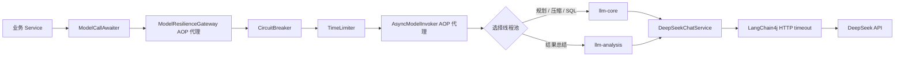
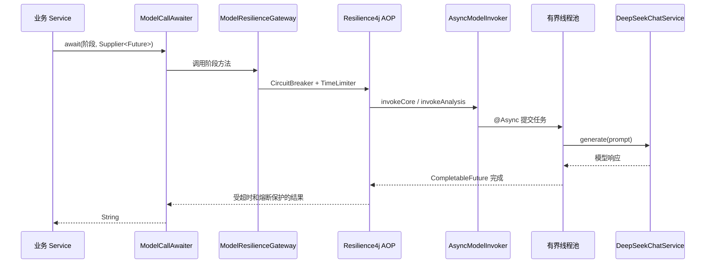
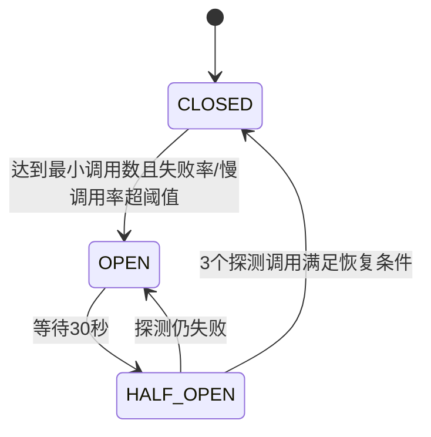
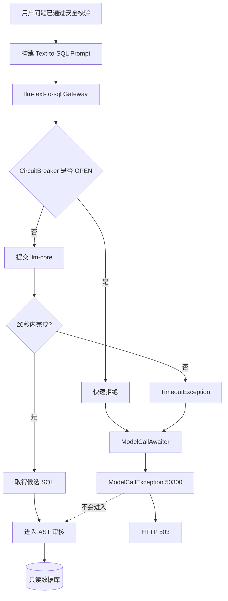

# 第31～33天：LLM 异步隔离、超时熔断与分级降级学习手册

> 本文严格对应当前项目源码，目标不是只会背 `@Async`、CircuitBreaker 和 TimeLimiter，
> 而是理解它们为什么要组合、各自解决什么问题，以及它们如何嵌入 Text-to-SQL 主链路。

## 1. 三天最终解决了什么问题

引入模型以后，系统会面对普通数据库 CRUD 项目很少遇到的故障：

- 模型接口可能在数秒到数十秒后才响应；
- 供应商可能返回 429、5xx、认证失败或网络异常；
- 大量慢请求会持续占用 Tomcat 请求线程和模型调用线程；
- 结果总结不是核心能力，不应该因为它失败而丢掉已经查询出的数据；
- Text-to-SQL 是数据库查询的前置条件，没有 SQL 时绝不能继续访问数据库；
- 上下文规划和压缩失败时，需要保护会话一致性；
- 如果所有模型任务共用一个线程池，可选的结果总结可能拖垮核心 SQL 生成。

这三天最终形成了四层保护：

| 层次 | 技术 | 主要职责 |
|---|---|---|
| 资源隔离 | 有界 `ThreadPoolTaskExecutor` | 限制并发任务和等待队列，防止无限堆积 |
| 等待上限 | Resilience4j TimeLimiter | 限制当前业务请求最多等待模型多久 |
| 故障隔离 | Resilience4j CircuitBreaker | 供应商持续异常时快速失败，减少无意义调用 |
| 最终停止线 | LangChain4j HTTP timeout | 即使上层 Future 超时，底层 HTTP 最终也必须退出 |

一句话概括：

> 有界线程池控制“最多容纳多少任务”，TimeLimiter 控制“当前请求最多等多久”，
> CircuitBreaker 控制“持续失败时还要不要继续调用”，HTTP timeout 控制“底层 I/O 最晚何时真正结束”。

## 2. 最终调用架构



成功调用的大致时序如下：



关键点是：业务接口仍然可以同步返回完整查询结果，但阻塞式模型 I/O 已经被转移到受控线程池，
并且能够被 TimeLimiter 包装。

## 3. 三天工作拆分

| 天数 | 核心目标 | 主要产物 |
|---|---|---|
| 第31天 | 建立异步和超时基础设施 | 依赖、模型 HTTP 超时、三类有界线程池、MDC 传播 |
| 第32天 | 接入四阶段熔断和分级降级 | 异步调用器、韧性网关、异常分类、503 映射、四阶段降级 |
| 第33天 | 完成可观测性和故障验收 | 熔断指标、线程池 Gauge、Actuator 端点、饱和与开路测试、运维手册 |

---

## 4. 第31天：先把异步调用基础打牢

### 4.1 为什么新增 AOP 和 Resilience4j

[pom.xml](../pom.xml) 新增了：

```xml
<dependency>
    <groupId>org.springframework.boot</groupId>
    <artifactId>spring-boot-starter-aop</artifactId>
</dependency>
<dependency>
    <groupId>io.github.resilience4j</groupId>
    <artifactId>resilience4j-spring-boot3</artifactId>
    <version>2.2.0</version>
</dependency>
```

`@Async`、`@CircuitBreaker` 和 `@TimeLimiter` 都依赖 Spring 代理。业务调用必须经过代理对象，
注解才会生效。这也是后面把“异步调用器”和“韧性网关”拆成独立 Bean 的原因。

### 4.2 第一层超时：模型 HTTP 客户端 25 秒

[DeepSeekProperties](../src/main/java/com/aianalyst/config/DeepSeekProperties.java) 新增两个配置：

- `timeout = 25s`；
- `maxRetries = 0`，只允许配置为 0～1。

[DeepSeekChatServiceImpl](../src/main/java/com/aianalyst/service/impl/DeepSeekChatServiceImpl.java)
把配置传给 LangChain4j：

```java
.timeout(properties.getTimeout())
.maxRetries(properties.getMaxRetries())
```

默认关闭传输层重试有三个原因：

1. 模型本来就慢，自动重试会进一步放大请求耗时；
2. 供应商故障时，多实例同时重试容易形成重试风暴；
3. 项目已有明确的 SQL 语义纠错预算，不能把“网络重试”和“SQL 纠错”混为一谈。

这里要区分两种重试：

| 类型 | 解决的问题 | 当前策略 |
|---|---|---|
| HTTP 传输重试 | 网络抖动、临时 5xx | 默认 0，最多允许 1 |
| SQL 语义纠错 | 多语句、语法/字段错误 | 业务代码显式管理，共享最多两次预算 |

### 4.3 为什么需要三个模型工作线程池

[AsyncExecutorProperties](../src/main/java/com/aianalyst/config/AsyncExecutorProperties.java)
定义了三组默认参数：

| 线程池 | core | max | queue | 当前用途 |
|---|---:|---:|---:|---|
| `llm-core` | 4 | 6 | 20 | 上下文规划、上下文压缩、Text-to-SQL |
| `llm-analysis` | 1 | 2 | 10 | 查询结果总结 |
| `query-orchestration` | 4 | 8 | 50 | 为后续异步查询编排预留，当前主链路尚未使用 |

为什么结果分析要单独隔离？

假设结果总结突然变慢，如果它和 Text-to-SQL 共用一个池，分析任务可能占满全部线程，导致新请求
连 SQL 都生成不了。独立线程池可以让“可选能力退化”，而不是让“核心能力一起宕机”。

从单实例最大容纳量看：

- 核心模型池最多同时容纳约 `max 6 + queue 20 = 26` 个已接收任务；
- 分析池最多同时容纳约 `max 2 + queue 10 = 12` 个已接收任务；
- 超过容量后立即拒绝，不再继续积压。

这些数字不是通用最佳值。生产环境应根据模型配额、平均/P95 延迟、实例数量和可接受排队时间压测，
不能只因为请求增多就无限放大队列。

### 4.4 为什么使用有界队列和 AbortPolicy

[LlmAsyncExecutorConfig](../src/main/java/com/aianalyst/config/LlmAsyncExecutorConfig.java)
统一设置：

```java
executor.setQueueCapacity(...);
executor.setRejectedExecutionHandler(new ThreadPoolExecutor.AbortPolicy());
```

选择原因：

- 无界队列会在供应商变慢时不断堆积任务，最终耗尽内存；
- `CallerRunsPolicy` 会让 Tomcat 请求线程亲自执行模型调用，把异步隔离重新变成同步阻塞；
- `AbortPolicy` 能让过载立即显现，随后由业务阶段决定返回 503 还是使用降级结果。

这属于背压：系统明确告诉上游“当前容量已经用完”，而不是假装还能无限接收。

### 4.5 为什么需要 MDC TaskDecorator

HTTP 请求的 Trace ID 位于 MDC 中。线程切换后，普通 `ThreadLocal` 不会自动传播，所以新增了
[MdcTaskDecorator](../src/main/java/com/aianalyst/config/MdcTaskDecorator.java)。

它做了三件事：

1. 提交任务时复制调用线程 MDC；
2. 执行任务前写入线程池工作线程；
3. 执行完成后恢复原值，防止线程复用导致 Trace ID 串请求。

只复制不清理是常见错误。线程池会复用线程，如果不在 `finally` 中恢复或清空 MDC，下一次任务
可能携带上一个用户请求的 Trace ID。

### 4.6 `@Async` 的几个生效条件

- 方法需要通过 Spring Bean 代理调用；
- 不要在同一个对象内部用 `this.asyncMethod()` 自调用；
- 当前实现返回 `CompletableFuture<String>`，供 TimeLimiter 包装；
- 使用 `@Async("llmCoreExecutor")` 等名称显式选择线程池；
- 异步任务抛出的异常会进入 Future，而不是直接在调用线程抛出；但任务提交阶段的线程池拒绝
  仍可能同步抛出。

最后一点解释了为什么后面 `ModelCallAwaiter` 接收的是 `Supplier<CompletableFuture<String>>`，
而不是只接收一个已经创建好的 Future。

---

## 5. 第32天：四阶段熔断和分级降级

### 5.1 为什么拆成 AsyncModelInvoker 和 ModelResilienceGateway

[AsyncModelInvokerImpl](../src/main/java/com/aianalyst/service/impl/AsyncModelInvokerImpl.java) 只负责：

- 把阻塞式 `DeepSeekChatService.generate()` 放到指定线程池；
- 核心任务进入 `llm-core`；
- 结果分析进入 `llm-analysis`。

[ModelResilienceGatewayImpl](../src/main/java/com/aianalyst/service/impl/ModelResilienceGatewayImpl.java)
只负责：

- 按业务阶段选择熔断器；
- 为返回的 CompletableFuture 增加 TimeLimiter；
- 把四种业务阶段和底层模型调用解耦。

这种拆分还解决了 Spring AOP 自调用失效问题。业务 Service 调用的是 Gateway 代理，Gateway
再调用 AsyncModelInvoker 代理，两层注解都能经过 Spring 代理边界。

### 5.2 四个阶段为什么不能共用一个熔断器

| 阶段 | 熔断器 | TimeLimiter | 线程池 |
|---|---|---:|---|
| 上下文规划 | `llm-context-planning` | 15s | `llm-core` |
| Text-to-SQL 与纠错 | `llm-text-to-sql` | 20s | `llm-core` |
| 上下文压力压缩 | `llm-context-compression` | 15s | `llm-core` |
| 结果总结 | `llm-result-analysis` | 10s | `llm-analysis` |

如果四个阶段共用一个熔断器，结果分析持续失败可能把 Text-to-SQL 一起熔断。拆开以后：

- 各阶段拥有独立失败率；
- 结果总结可以单独 OPEN；
- SQL 生成仍然可以工作；
- 不同阶段可以设置不同等待时间和降级行为。

注意：熔断器隔离的是“故障统计和开关状态”，线程池隔离的是“运行资源”。上下文规划、压缩和
Text-to-SQL 虽然使用三个熔断器，但目前仍共享 `llm-core` 线程资源。

### 5.3 CircuitBreaker 状态机



共享配置位于 [application.yml](../src/main/resources/application.yml)：

| 参数 | 当前值 | 含义 |
|---|---:|---|
| sliding window | 20 次 | 只统计最近 20 次调用 |
| minimum calls | 10 次 | 少于 10 次时不计算开路 |
| failure threshold | 50% | 失败率达到 50% 可 OPEN |
| slow threshold | 15s | 超过 15 秒属于慢调用 |
| slow-call rate | 60% | 慢调用率达到 60% 可 OPEN |
| OPEN duration | 30s | 30 秒内快速拒绝 |
| HALF_OPEN probes | 3 次 | 用 3 次探测判断是否恢复 |

举例：窗口里已经有 10 次有效模型调用，其中 5 次属于供应商失败，失败率为 50%，达到阈值后
熔断器可以进入 OPEN。OPEN 期间不会再调用模型，直接抛出 `CallNotPermittedException`。

一个当前配置细节：规划/压缩超时为 15 秒、结果分析超时为 10 秒，而共享慢调用阈值是 15 秒。
因此这些阶段通常会先以“超时失败”结束，慢调用率对 20 秒超时的 Text-to-SQL 更有实际意义。
如果以后希望每个阶段都独立观察慢调用率，应为四个熔断器配置不同的慢调用阈值。

### 5.4 哪些异常才应该计入熔断

[ModelCircuitBreakerFailurePredicate](../src/main/java/com/aianalyst/config/ModelCircuitBreakerFailurePredicate.java)
只记录供应商可用性故障：

- Java 或 LangChain4j 超时；
- `IOException`；
- LangChain4j `RetriableException`；
- 认证失败、无法解析模型服务地址；
- HTTP 401、403、408、429 和 5xx。

以下异常不能算成供应商故障：

- Prompt 或 Token 预算等 `BusinessException`；
- 非法参数；
- SQL 解析、AST 审核等本地业务失败；
- `TaskRejectedException` / `RejectedExecutionException`；
- 熔断器已经 OPEN 后产生的 `CallNotPermittedException`。

为什么线程池拒绝不能计入模型熔断？

因为它表示“本机容量不足”，不是“DeepSeek 不可用”。如果把本机过载算成供应商失败，熔断器
会掩盖真正的容量问题，排障时也无法区分究竟该扩容还是联系模型供应商。

### 5.5 为什么还需要 IgnorePredicate

只让 `recordFailurePredicate` 返回 false 还不够。在 CircuitBreaker 中，一个没有被记录为失败的
异常可能被当作成功样本，从而稀释真实失败率。

[ModelCircuitBreakerIgnorePredicate](../src/main/java/com/aianalyst/config/ModelCircuitBreakerIgnorePredicate.java)
使用失败谓词的逻辑取反，把所有非供应商故障彻底排除出滑动窗口：

```text
供应商可用性异常 -> record=true，ignore=false
本地业务或容量异常 -> record=false，ignore=true
```

因此本地业务校验和线程池拒绝既不算失败，也不会伪装成成功调用。

### 5.6 ModelCallAwaiter 为什么接收 Supplier

[ModelCallAwaiter](../src/main/java/com/aianalyst/service/ModelCallAwaiter.java) 的核心形式是：

```java
ModelCallAwaiter.await(
        ModelCallType.TEXT_TO_SQL,
        () -> modelResilienceGateway.generateSql(prompt));
```

使用 Supplier 有两个目的：

1. 捕获 `future.join()` 中包装的异步异常；
2. 捕获调用 Gateway、提交异步任务时同步抛出的线程池拒绝。

它会逐层解开 `CompletionException` / `ExecutionException`：

- 如果根因本来就是 `BusinessException`，原样抛出，保留业务错误码；
- 其他模型基础设施异常统一转换为 `ModelCallException`；
- `ModelCallException` 携带 `ModelCallType`，但对客户端只暴露稳定文案。

统一错误码为：

```text
code = 50300
message = AI 查询服务暂不可用，请稍后重试
HTTP status = 503 Service Unavailable
```

HTTP 503 由 [GlobalExceptionHandler](../src/main/java/com/aianalyst/handler/GlobalExceptionHandler.java)
完成映射。

### 5.7 四阶段的降级策略

降级不能只写一个统一 fallback，因为每个阶段丢失的信息不同。

#### 1. 上下文规划失败

[DeepSeekConversationQuestionResolver](../src/main/java/com/aianalyst/service/impl/DeepSeekConversationQuestionResolver.java)
区分两种问题：

- `那华东呢？`、`换成去年` 等省略式追问依赖旧上下文，无法安全推断，提示用户补全条件；
- `查询本月客户总数` 等完整问题可以降级为单轮查询。

当前实现中，完整问题降级时会通过乐观锁清空可复用旧上下文，并把当前问题标记为新话题，
避免旧主题状态泄漏进后续轮次。

#### 2. Text-to-SQL 失败

[TextToSqlServiceImpl](../src/main/java/com/aianalyst/service/impl/TextToSqlServiceImpl.java) 直接抛出
`ModelCallException`，最终返回 HTTP 503。

原因很简单：没有 SQL，就没有可审核、可执行的输入。系统不会猜 SQL，也不会使用上一次 SQL，
更不会绕过 AST 审核直接访问数据库。

同一个 `llm-text-to-sql` 熔断器也覆盖：

- 首次 SQL 生成；
- SQL 格式审核后的有界修复；
- 数据库语法/字段错误后的剩余纠错。

模型故障不会触发额外的自动重试，更不会执行一个失败或未审核的候选 SQL。

#### 3. 上下文压力压缩失败

压缩结果只有在解析和 Token 校验通过后，才会调用 `contextService.updateContext()`。

如果模型超时或熔断：

- 当前请求返回模型服务不可用；
- 不写入新摘要；
- 不删除旧轮次；
- 原始上下文保持不变。

这体现了“先生成并校验，再原子更新”的一致性原则。

#### 4. 结果总结失败

[ResultAnalysisServiceImpl](../src/main/java/com/aianalyst/service/impl/ResultAnalysisServiceImpl.java)
捕获模型异常，返回：

```text
查询成功，共返回 N 条数据。AI 总结暂不可用，请查看下方明细数据。
```

因为此时 SQL 已审核、数据库已执行、结果也已脱敏。AI 总结只是增强信息，不能反过来让已经成功的
数据查询失败。

### 5.8 TimeLimiter 为什么不能替代 HTTP timeout

当前阶段超时分别为 10～20 秒，底层 HTTP timeout 为 25 秒。TimeLimiter 超时后，调用方会停止
等待并走降级，但 `cancel-running-future=true` 不代表所有阻塞式 HTTP I/O 都能立刻停止。

可能出现以下时间线：

```text
0s    模型任务进入线程池
10s   结果分析 TimeLimiter 超时，业务请求返回降级结果
10s+  底层 HTTP 可能仍占用工作线程
25s   LangChain4j HTTP timeout 最终终止底层调用
```

所以必须同时存在：

- 较短的业务等待上限；
- 较长但有限的底层 HTTP 最终停止线；
- 有界线程池，限制超时后残留任务的总量。

---

## 6. 第33天：可观测性、压力验收与运维

### 6.1 Resilience4j 自动指标

`resilience4j-spring-boot3` 已传递引入 Micrometer 集成，项目可通过 Actuator 查看：

| 指标 | 观察内容 |
|---|---|
| `resilience4j.circuitbreaker.calls` | 成功、失败、忽略调用耗时和次数 |
| `resilience4j.circuitbreaker.state` | CLOSED、OPEN、HALF_OPEN 等状态 |
| `resilience4j.circuitbreaker.failure.rate` | 当前失败率 |
| `resilience4j.circuitbreaker.slow.call.rate` | 当前慢调用率 |
| `resilience4j.circuitbreaker.not.permitted.calls` | OPEN 后被快速拒绝的次数 |
| `resilience4j.timelimiter.calls` | 成功、失败和超时次数 |

使用 `name` 标签区分四个模型阶段，不在指标标签中放用户 ID、问题或 SQL，避免高基数和敏感信息泄漏。

### 6.2 自定义线程池指标

[ModelExecutorMetrics](../src/main/java/com/aianalyst/service/impl/ModelExecutorMetrics.java) 为三个池注册：

| 指标 | 含义 |
|---|---|
| `ai.model.executor.active` | 当前正在执行的任务数 |
| `ai.model.executor.pool.size` | 当前工作线程数 |
| `ai.model.executor.queue.size` | 当前排队任务数 |
| `ai.model.executor.queue.remaining` | 队列剩余容量 |

使用固定标签：

```text
pool=core
pool=analysis
pool=orchestration
```

为什么用 Gauge？这些值描述的是线程池瞬时状态，直接读取真实线程池比额外维护 Counter 更准确。

### 6.3 Actuator 端点与权限

当前暴露：

```text
GET /api/actuator/metrics
GET /api/actuator/circuitbreakers
GET /api/actuator/circuitbreakerevents
GET /api/actuator/timelimiters
GET /api/actuator/timelimiterevents
```

只有 `/api/actuator/health` 允许匿名访问。其他 `/actuator/**` 端点由 Spring Security 限制为
ADMIN，避免普通用户看到内部容量和故障信息。

查看某个指标时可使用：

```text
GET /api/actuator/metrics/resilience4j.circuitbreaker.calls
GET /api/actuator/metrics/resilience4j.timelimiter.calls
GET /api/actuator/metrics/ai.model.executor.queue.size
```

### 6.4 自动化故障测试如何设计

[ModelResilienceGatewayIntegrationTest](../src/test/java/com/aianalyst/service/impl/ModelResilienceGatewayIntegrationTest.java)
把生产配置缩小为 2 次窗口、50ms 超时，并使用 Mock Invoker 验证：

1. 连续两次供应商超时后，Text-to-SQL 熔断器进入 OPEN；
2. 第三次调用被快速拒绝，底层 Invoker 调用次数仍为 2；
3. 永不完成的 Future 会被 TimeLimiter 截止；
4. `TaskRejectedException` 不进入熔断窗口；
5. Resilience4j 指标已经注册。

[AsyncModelInvokerImplTest](../src/test/java/com/aianalyst/service/impl/AsyncModelInvokerImplTest.java)
使用真实 `@Async` 代理和容量为 0 的测试队列验证：

- 第一个核心模型任务占住唯一工作线程；
- 第二个核心任务立即被拒绝；
- 同一时间，结果分析仍能在 `llm-analysis` 池完成；
- 证明资源隔离不是只停留在配置文件里。

[ModelExecutorMetricsTest](../src/test/java/com/aianalyst/service/impl/ModelExecutorMetricsTest.java)
验证所有 Gauge 及 `pool` 标签均已注册。

这些测试全部使用 Mock 模型，不调用真实 DeepSeek，不访问数据库，也不会产生模型费用。

### 6.5 建议告警

- `llm-text-to-sql` 或 `llm-context-planning` 进入 OPEN：立即告警；
- Text-to-SQL TimeLimiter 超时持续增长：立即告警；
- `pool=core` 队列使用率连续 5 分钟超过 80%：容量告警；
- `pool=analysis` 拥塞：非核心功能降级告警；
- HTTP 503 增加时，同时检查熔断事件和队列剩余容量；
- 如果熔断失败率高但线程池空闲，优先排查模型供应商；
- 如果熔断器 CLOSED 但队列接近满，优先排查本机容量、模型变慢或入口流量突增。

---

## 7. 一次 Text-to-SQL 超时会发生什么



这里最重要的安全结论是：

> 模型超时或熔断时没有可信 SQL，主链路会在 SQL 审核和数据库执行之前终止。

## 8. 推荐源码阅读顺序

按下面顺序阅读最容易建立完整认识：

1. [application.yml](../src/main/resources/application.yml)：先记住线程池、熔断和超时参数；
2. [AsyncExecutorProperties](../src/main/java/com/aianalyst/config/AsyncExecutorProperties.java)：理解配置模型；
3. [LlmAsyncExecutorConfig](../src/main/java/com/aianalyst/config/LlmAsyncExecutorConfig.java)：理解有界池和拒绝策略；
4. [MdcTaskDecorator](../src/main/java/com/aianalyst/config/MdcTaskDecorator.java)：理解跨线程日志上下文；
5. [AsyncModelInvokerImpl](../src/main/java/com/aianalyst/service/impl/AsyncModelInvokerImpl.java)：理解任务如何切换线程；
6. [ModelResilienceGatewayImpl](../src/main/java/com/aianalyst/service/impl/ModelResilienceGatewayImpl.java)：理解四阶段注解；
7. [ModelCircuitBreakerFailurePredicate](../src/main/java/com/aianalyst/config/ModelCircuitBreakerFailurePredicate.java)：理解故障统计；
8. [ModelCircuitBreakerIgnorePredicate](../src/main/java/com/aianalyst/config/ModelCircuitBreakerIgnorePredicate.java)：理解“忽略”和“成功”的区别；
9. [ModelCallAwaiter](../src/main/java/com/aianalyst/service/ModelCallAwaiter.java)：理解异常解包和统一出口；
10. [DeepSeekConversationQuestionResolver](../src/main/java/com/aianalyst/service/impl/DeepSeekConversationQuestionResolver.java)：看规划与压缩降级；
11. [TextToSqlServiceImpl](../src/main/java/com/aianalyst/service/impl/TextToSqlServiceImpl.java)：看核心阶段如何终止；
12. [ResultAnalysisServiceImpl](../src/main/java/com/aianalyst/service/impl/ResultAnalysisServiceImpl.java)：看可选阶段如何降级；
13. [ModelExecutorMetrics](../src/main/java/com/aianalyst/service/impl/ModelExecutorMetrics.java)：看线程池指标；
14. 最后阅读三个核心测试，理解如何证明代码真的生效。

## 9. 常见误区

### 误区1：加了 TimeLimiter，底层 HTTP 一定立即停止

不一定。TimeLimiter 首先保证调用方不再等待；阻塞式 I/O 是否响应 Future cancel 取决于底层实现，
所以仍需要 25 秒 HTTP timeout。

### 误区2：线程池越大，吞吐量越高

模型调用受供应商配额、网络和延迟约束。线程过多可能带来更多 429、连接占用和上下文切换。
线程池大小必须通过压测和配额反推。

### 误区3：队列满了使用 CallerRunsPolicy 最可靠

对模型调用不合适。它会让 HTTP 请求线程执行长耗时任务，破坏资源隔离并拖慢整个 Web 容器。

### 误区4：所有异常都应该让熔断器计数

SQL 审核失败、Token 超限和线程池饱和都不是供应商故障。错误统计会导致误开路和错误排障。

### 误区5：一个模型供应商只需要一个熔断器

同一个供应商承担的业务阶段可能有不同重要性。结果总结失败不应影响 SQL 生成，因此按业务阶段隔离。

### 误区6：`@Async` 写在 private 方法或同类自调用也会生效

Spring 默认使用代理拦截外部调用，同类自调用不会经过代理。当前项目使用独立 Invoker Bean 解决。

### 误区7：熔断就是重试

熔断是持续故障时停止调用；重试是一次失败后再次调用。二者目标不同，叠加不当会放大流量。

### 误区8：结果总结失败就应该整次查询失败

结果总结是增强能力。已经取得的脱敏数据仍然有价值，应该保留数据并降级文案。

## 10. 面试问题与参考回答

### 1. 你为什么在同步接口中使用 CompletableFuture？

接口仍需一次返回完整结果，但底层模型 I/O 是阻塞调用。我使用 `@Async` 把它放入有界线程池，
返回 CompletableFuture 让 Resilience4j TimeLimiter 能控制等待时间，同时保留同步业务编排。

### 2. 为什么同时需要 TimeLimiter 和 HTTP timeout？

TimeLimiter 控制业务请求等待时间，HTTP timeout 是底层 I/O 最终停止线。Future 被取消不保证阻塞式
HTTP 立即终止，所以两层超时必须同时存在。

### 3. 为什么有四个熔断器？

上下文规划、SQL 生成、上下文压缩和结果总结的重要性与降级方式不同。独立熔断器避免非核心结果
总结故障把核心 SQL 生成一起熔断。

### 4. 为什么还要分两个模型线程池？

熔断器隔离状态，不隔离线程资源。核心模型任务与可选结果分析分池，才能保证分析池拥塞时核心 SQL
仍有工作线程。

### 5. 为什么不使用无界队列？

供应商变慢时，无界队列会持续积压请求，增加内存、排队时间和超时后残留任务，最终可能拖垮实例。

### 6. 为什么使用 AbortPolicy？

容量耗尽时快速暴露过载，由业务阶段决定返回 503 或降级。CallerRunsPolicy 会阻塞请求线程，破坏隔离。

### 7. 线程池拒绝会触发模型熔断吗？

不会。它属于本机容量故障，IgnorePredicate 会把它排除出熔断窗口，防止错误归因到供应商。

### 8. Text-to-SQL 熔断后为什么不能查询数据库？

没有模型生成的候选 SQL，就没有可经 AST 审核的 SQL。使用旧 SQL、猜测 SQL 或绕过审核都有数据安全风险，
所以直接返回 503。

### 9. 结果总结熔断后如何处理？

保留已经审核和执行完成的 SQL 结果，返回脱敏数据和“AI 总结暂不可用”的文案。

### 10. 上下文压缩失败为什么不裁剪？

只有模型生成并通过格式、长度和 Token 校验的摘要才能替代旧轮次。压缩失败时裁剪会造成上下文信息丢失，
所以不更新摘要，也不删除原始轮次。

### 11. 如何避免熔断器被业务异常污染？

使用自定义失败谓词只记录超时、网络、429、5xx 等供应商可用性故障，再用 IgnorePredicate 把其他异常
排除出窗口。

### 12. 为什么默认关闭模型自动重试？

避免慢调用和供应商故障时形成重试放大；项目的 SQL 纠错由业务层显式控制，不能和传输重试混用。

### 13. 如何证明线程池真的隔离？

测试中把核心池缩为一个线程、零队列并阻塞该线程，然后验证新核心任务被拒绝，但分析任务仍在独立池完成。

### 14. 熔断器是全局共享的吗？

当前是单体应用内每个实例各自维护状态。多实例部署时每个 JVM 独立熔断，不是 Redis 中的分布式熔断器。

### 15. 为什么没有再引入 Resilience4j Bulkhead？

当前已经用独立有界线程池完成并发和队列隔离。再叠加 Bulkhead 会增加参数和排障复杂度；只有现有隔离无法
满足并发许可控制时才考虑增加。

## 11. 动手学习与验证

### 11.1 运行核心测试

```powershell
.\mvnw.cmd -Dtest=AsyncModelInvokerImplTest test
.\mvnw.cmd -Dtest=ModelResilienceGatewayIntegrationTest test
.\mvnw.cmd -Dtest=ModelExecutorMetricsTest test
.\mvnw.cmd test
```

当前全量结果：185 个测试，0 失败、0 错误，15 个需要外部环境的条件式集成测试跳过。

### 11.2 推荐断点

按以下位置打断点并单步观察：

1. `ModelCallAwaiter.await()`：观察 Supplier 调用和异常解包；
2. `ModelResilienceGatewayImpl.generateSql()`：观察 AOP 代理前后的线程；
3. `AsyncModelInvokerImpl.invokeCore()`：观察线程名切换为 `llm-core-*`；
4. `DeepSeekChatServiceImpl.generate()`：观察 Token 预算检查；
5. `GlobalExceptionHandler.handleBusinessException()`：观察 503 映射。

### 11.3 建议练习

1. 在测试配置中把窗口改成 4、最小调用数改成 4，分别模拟 25%、50%、75% 失败率；
2. 把核心池设置为 1/1/1，观察第三个任务何时被拒绝；
3. 给 Mock 模型增加 100ms 延迟，把 TimeLimiter 设置为 50ms，观察超时指标；
4. 让结果分析失败，确认数据仍返回；
5. 让 Text-to-SQL 失败，确认 SQL 审核和数据库执行 Mock 都没有被调用；
6. 在 MDC 中放入 requestId，验证异步线程能读取且下一任务不会继承旧值。

不要直接用真实模型接口做高并发故障实验，以免产生费用、429 和不可控的外部影响。

## 12. 当前实现边界与后续优化方向

学习时要区分“已经实现”和“可以继续扩展”：

### 已经实现

- 三类有界异步线程池；
- 核心与分析资源隔离；
- 四个阶段独立 CircuitBreaker 和 TimeLimiter；
- 底层模型 HTTP 最终超时；
- 供应商异常和本地异常分类；
- 阶段化降级与 HTTP 503；
- Resilience4j、线程池指标和管理员 Actuator 端点；
- 开路、超时、拒绝、隔离、降级自动化测试。

### 尚未实现或有意保留

- `query-orchestration` 线程池目前是预留能力，主查询 Controller 尚未异步化；
- 没有外接 Prometheus/Grafana，当前由 Actuator/Micrometer 暴露指标；
- 告警阈值已经写入运维建议，但没有在具体监控平台创建告警规则；
- 熔断配置来自本地 YAML，不是动态配置中心；
- 熔断状态是单 JVM 的，不在多个实例之间共享；
- TimeLimiter 超时后，底层阻塞 HTTP 可能继续到 25 秒最终超时；
- 没有叠加 Resilience4j Bulkhead，因为有界独立线程池已承担当前隔离职责。

## 13. 可以写进简历的项目亮点

> **分阶段大模型韧性治理：**针对上下文规划、Text-to-SQL、上下文压缩和结果总结四类模型调用，
> 基于有界 `@Async` 线程池、CompletableFuture、Resilience4j CircuitBreaker 与 TimeLimiter
> 建立分阶段超时熔断机制；核心 SQL 生成与可选结果分析使用独立线程池隔离，按业务阶段实现单轮查询、
> 503 快速失败、上下文不裁剪和保留查询数据等差异化降级，并通过 Micrometer 指标及故障注入测试验证
> 开路、超时和线程池饱和行为。

## 14. 最后复习：四个最重要的判断

1. **先判断故障属于谁。** 供应商故障进入熔断，本地容量和业务校验单独处理。
2. **先判断阶段是否可降级。** 没有 SQL 不能继续，有数据但没有总结可以继续。
3. **超时不等于底层任务消失。** TimeLimiter、HTTP timeout 和有界池必须配合。
4. **熔断状态隔离不等于资源隔离。** 四个熔断器之外，核心与分析还需要独立线程池。

掌握这四点，就不是只会“加几个注解”，而是真正理解了这套模型调用韧性方案。
